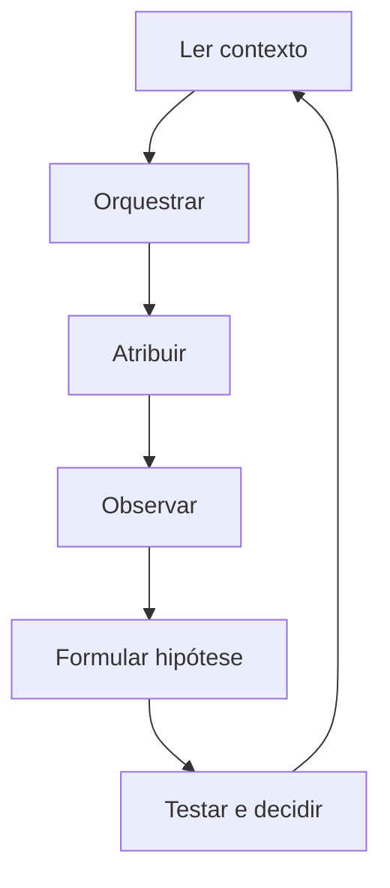

# ACJ-00 — Orquestração, Aprendizagem e Evolução da Jornada

**Documento de governança da Biblioteca Arquiteturas de Conexão e Jornada**

> **Princípio central:** A Hive não distribui conteúdos apenas para ocupar canais. Orquestra movimentos capazes de construir uma jornada e aprende com o que essa jornada produz.

# 1 Definição

A ACJ-00 é a arquitetura que governa a combinação, aplicação, observação e evolução das demais Arquiteturas de Conexão e Jornada. Ela transforma a estratégia da campanha em um plano relacional, distribui esse plano pelos ciclos, orienta a atribuição de ACJs aos conteúdos e conduz a aprendizagem decorrente da execução.

Sua função não é criar pautas, textos ou peças. Sua função é estabelecer o movimento que essas estruturas devem servir, preservar coerência ao longo da jornada e impedir que resultados isolados alterem prematuramente a arquitetura da Hive.

# 2 Propósito

- traduzir estratégia de campanha em necessidades relacionais observáveis;
- propor a composição de ACJ-01 a ACJ-05 para a campanha e seus ciclos;
- identificar lacunas, excessos, saturações e transições necessárias;
- orientar qual movimento cada conteúdo-mãe deve produzir;
- aprender com feedback de Marcos, resposta da audiência e resultados da jornada;
- proteger as arquiteturas consolidadas contra mudanças precipitadas;
- ampliar progressivamente a capacidade da Hive de orquestrar jornadas mais adequadas ao contexto.

# 3 Posição na arquitetura da Hive

A ACJ-00 opera depois que a campanha define o que precisa acontecer e antes que a Hive selecione editorias, territórios, narrativas, pautas e templates. Ela continua ativa depois da publicação, fechando o ciclo de observação e aprendizagem.

Estratégia → ACJ-00 → composição da jornada → pauta → conteúdo-mãe → peças → agenda → resposta → ACJ-00

Mudanças estruturais só são consolidadas após teste e validação.

# 4 Escopo e limites

| **A ACJ-00 decide**                          | **A ACJ-00 não decide sozinha**                             |
|----------------------------------------------|-------------------------------------------------------------|
| propor mix ACJ de campanha e ciclo           | a estratégia de negócio ou o objetivo comercial             |
| priorizar movimentos relacionais             | a verdade sobre o público sem evidência suficiente          |
| atribuir ACJ primária e sugerir secundária   | o conteúdo final sem passar pelas bibliotecas editoriais    |
| recomendar sequência e testes                | mudanças estruturais sem validação                          |
| classificar o tipo de ajuste necessário      | a aprovação final de novas arquiteturas                     |
| promover aprendizados validados para revisão | substituir o julgamento de Marcos em decisões de identidade |

# 5 Entradas obrigatórias

| **Fonte**             | **Informação necessária**                                                                                         |
|-----------------------|-------------------------------------------------------------------------------------------------------------------|
| Estratégia            | objetivo da campanha, estágio do negócio, produto ou experiência, audiência prioritária, duração e fases          |
| Base Hive             | avatar, territórios, narrativas, linguagem, editorias, repertório, restrições e princípios                        |
| Operação              | conteúdos publicados, programados, em produção e disponíveis; frequência e canais                                 |
| Histórico             | campanhas anteriores, ACJs utilizadas, resultados, padrões recentes e testes já realizados                        |
| Feedback de Marcos    | aprovação, rejeição, ajustes, percepção de coerência, autenticidade e potência                                    |
| Resposta da audiência | alcance qualificado, atenção, salvamentos, compartilhamentos, comentários, respostas, DMs, cliques e outras ações |
| Jornada               | inscrições, participação, consumo, retorno, progressão, compra, permanência e aprofundamento quando aplicáveis    |
| Contexto temporal     | fase da campanha, proximidade de eventos, sazonalidade, saturação e sobreposição com outras campanhas             |

# 6 Saídas da ACJ-00

| **Saída**                | **Conteúdo**                                                                                           |
|--------------------------|--------------------------------------------------------------------------------------------------------|
| Plano ACJ da campanha    | mix-alvo, lógica por fase, hipóteses de sequência, sinais esperados e regras de recalibração           |
| Plano ACJ do ciclo       | mix operacional, lacunas, saturações, prioridades e justificativa                                      |
| Contrato do conteúdo-mãe | ACJ primária, secundária opcional, estado de origem, movimento desejado, mecanismo e resposta esperada |
| Regras de circulação     | ordem, espaçamento, reforços, pontes e conteúdos que não devem competir no mesmo período               |
| Recomendação de teste    | hipótese, variável, controle, duração, amostra mínima possível e critério de decisão                   |
| Registro de aprendizagem | observação, evidência, interpretação, confiança, implicação e status de consolidação                   |

# 7 Níveis de orquestração

| **Nível**    | **Responsabilidade**                                                                                     |
|--------------|----------------------------------------------------------------------------------------------------------|
| Campanha     | Define a intenção relacional global e o equilíbrio esperado entre as cinco arquiteturas.                 |
| Fase         | Ajusta o mix conforme descoberta, maturação, convite, entrega, continuidade ou outra lógica da campanha. |
| Ciclo        | Transforma o plano geral em prioridades executáveis, considerando histórico e momento.                   |
| Conteúdo-mãe | Define um movimento primário inequívoco e, quando necessário, um movimento secundário.                   |
| Peça         | Herda a ACJ e adapta sua manifestação ao canal sem alterar silenciosamente a intenção.                   |
| Portfólio    | Observa equilíbrio entre campanhas simultâneas para evitar concentração ou mensagens concorrentes.       |

# 8 Orquestração das proporções

As proporções ACJ são hipóteses operacionais, não cotas rígidas. Elas expressam o equilíbrio que a Hive considera mais adequado para produzir o movimento esperado naquele contexto. Devem ser recalculadas por fase e ciclo, preservando a coerência da campanha.

| **Leitura**    | **Definição**                                                                                                 |
|----------------|---------------------------------------------------------------------------------------------------------------|
| Mix-alvo       | Composição recomendada antes da execução, com base na estratégia e no estado percebido da audiência.          |
| Mix planejado  | Conteúdos aprovados ou em produção para realizar o mix-alvo.                                                  |
| Mix publicado  | Distribuição efetivamente colocada em circulação.                                                             |
| Mix respondido | Distribuição ponderada pela resposta relevante obtida por cada arquitetura.                                   |
| Lacuna         | Diferença relevante entre a necessidade do ciclo e o que já está planejado ou publicado.                      |
| Saturação      | Excesso recente de uma arquitetura, mecanismo ou manifestação, mesmo quando seu resultado isolado é positivo. |

## 8.1 Regras de proporção

**1** Nenhuma campanha precisa utilizar obrigatoriamente as cinco arquiteturas em todos os ciclos.

**2** A proporção deve responder ao momento da jornada, não à busca de variedade editorial.

**3** Uma arquitetura com bons resultados não deve crescer indefinidamente sem considerar saturação e função no sistema.

**4** A ausência de uma arquitetura pode ser intencional, desde que registrada e coerente com a estratégia.

**5** Alterações relevantes no mix precisam registrar motivo, hipótese e efeito esperado.

# 9 Sequenciamento sem funil rígido

Reconhecimento, Identificação, Conexão, Experimentação e Aprofundamento não formam uma escada obrigatória. Pessoas podem entrar em pontos diferentes, avançar, retornar, permanecer ou responder a mais de um movimento. A ACJ-00 trabalha com hipóteses de sequência, não com uma linearidade universal.

| **Conceito**       | **Uso**                                                                                                |
|--------------------|--------------------------------------------------------------------------------------------------------|
| Sequência provável | Ordem que parece mais adequada para um segmento, campanha ou fase, assumida como hipótese.             |
| Ponto de entrada   | Arquitetura capaz de acolher pessoas que ainda não tiveram contato com movimentos anteriores.          |
| Ponte              | Conteúdo que facilita uma passagem entre dois movimentos sem exigir conversão imediata.                |
| Reentrada          | Novo contato com alguém que já avançou, mas retorna por outro tema, necessidade ou contexto.           |
| Sustentação        | Repetição deliberada de um movimento quando a audiência ainda precisa de recorrência para integrá-lo.  |
| Descontinuidade    | Quebra na jornada causada por salto, excesso de convite, falta de conexão ou aprofundamento prematuro. |

# 10 Atribuição da ACJ ao conteúdo

Cada conteúdo-mãe deve possuir uma ACJ primária. Uma ACJ secundária é permitida quando descreve um efeito complementar real. Atribuir três ou mais arquiteturas ao mesmo conteúdo é proibido porque dilui a intenção e impede avaliação confiável.

| **Critério**                  | **Pergunta**                                                                   |
|-------------------------------|--------------------------------------------------------------------------------|
| Necessidade da jornada        | Qual movimento está ausente ou precisa ser sustentado agora?                   |
| Estado percebido da audiência | Que nível de consciência, vínculo, disponibilidade ou prontidão está presente? |
| Função estratégica            | Que objetivo de campanha o conteúdo precisa servir?                            |
| Potência da ideia             | Qual movimento a ideia realiza naturalmente, sem ser forçada?                  |
| Histórico recente             | Há repetição, saturação, lacuna ou oportunidade de continuidade?               |
| Próximo passo real            | Existe uma ação ou aprofundamento coerente disponível para a audiência?        |
| Mensurabilidade               | Que sinais plausíveis podem indicar se o movimento ocorreu?                    |

## 10.1 Regra de conflito

Quando estratégia, ideia e necessidade da jornada apontarem para arquiteturas diferentes, a ACJ-00 não deve escolher por média. Deve tornar o conflito explícito e recomendar uma destas decisões: trocar a ideia; redefinir o movimento; dividir em dois conteúdos; mudar o momento de publicação; ou preservar a ideia como exceção justificada.

# 11 Mecanismo de observação

A ACJ-00 observa três fontes complementares. Nenhuma delas, isoladamente, é suficiente para consolidar uma aprendizagem estrutural.

| **Fonte**             | **O que observar**                                                                                   |
|-----------------------|------------------------------------------------------------------------------------------------------|
| Feedback de Marcos    | coerência, autenticidade, clareza, potência percebida, desconfortos, ajustes e rejeições             |
| Resposta da audiência | atenção, linguagem utilizada nas respostas, identificação, diálogo, ações e padrões de comportamento |
| Resultados da jornada | progressão, participação, consumo, retorno, conversão, permanência e aprofundamento                  |

## 11.1 Evidência adequada

- comparação com conteúdos de contexto semelhante;
- repetição do padrão em mais de uma ocorrência;
- coerência entre sinais quantitativos e qualitativos;
- registro de fatores externos que possam explicar o resultado;
- distinção entre efeito da arquitetura, qualidade da ideia e execução da peça;
- confiança proporcional ao volume e à consistência das evidências.

# 12 Aprendizagem e classificação das mudanças

| **Decisão**               | **Implicação**                                                                                                  |
|---------------------------|-----------------------------------------------------------------------------------------------------------------|
| Ajuste de execução        | A arquitetura permanece válida. Corrigir texto, narrativa, CTA, canal, formato, visual, timing ou distribuição. |
| Ajuste de arquitetura     | Refinar definição, condições de uso, mecanismo, limites ou resultados esperados.                                |
| Nova variante             | Formalizar uma manifestação recorrente e distinta dentro de arquitetura existente.                              |
| Possível nova arquitetura | Abrir investigação quando o padrão não puder ser explicado pelas arquiteturas atuais.                           |

## 12.1 Regra de prudência

O melhor desempenho de uma peça não comprova a superioridade de uma arquitetura. O pior desempenho não comprova sua inadequação. Antes de alterar a estrutura, a Hive deve investigar conteúdo, execução, distribuição, público, contexto, fase e qualidade do dado.

# 13 Formulação e teste de hipóteses

Toda recomendação de evolução deve ser formulada de modo testável. Hipóteses vagas entram no Registro Vivo, mas não autorizam mudanças.

| **Campo**         | **Definição**                                                                    |
|-------------------|----------------------------------------------------------------------------------|
| Observação        | O que aconteceu, sem interpretação prematura.                                    |
| Padrão candidato  | Que repetição ou relação parece existir.                                         |
| Hipótese          | Qual explicação verificável pode justificar o padrão.                            |
| Variável de teste | O que será alterado e o que permanecerá constante.                               |
| Sinais esperados  | Que evidências apoiariam ou enfraqueceriam a hipótese.                           |
| Janela            | Em qual período, ciclo ou quantidade de ocorrências será observado.              |
| Decisão possível  | Manter, ajustar, ampliar teste, criar variante ou abrir investigação estrutural. |

# 14 Consolidação e versionamento

O Registro Vivo é a área de investigação. Os documentos ACJ são a arquitetura consolidada. A passagem entre os dois exige evidência, teste, decisão registrada e aprovação compatível com o impacto da mudança.

| **Estado**                | **Significado**                                                         |
|---------------------------|-------------------------------------------------------------------------|
| Observação aberta         | Registro factual ainda sem hipótese.                                    |
| Hipótese formulada        | Explicação candidata com teste proposto.                                |
| Em teste                  | Aplicação controlada em campanha, ciclo ou conjunto de conteúdos.       |
| Aprendizagem provisória   | Padrão sustentado, ainda sem alteração estrutural.                      |
| Validada                  | Evidência suficiente para recomendar mudança.                           |
| Consolidada               | Mudança incorporada a uma nova versão do documento afetado.             |
| Rejeitada ou inconclusiva | Hipótese não sustentada ou evidência insuficiente; registro preservado. |

## 14.1 Níveis de aprovação

- ajuste de execução: pode ser recomendado e aplicado pela Hive dentro dos limites já aprovados;
- ajuste de arquitetura: exige validação humana antes de alterar o documento consolidado;
- nova variante: exige teste específico e aprovação humana;
- nova arquitetura: exige documento próprio, comparação com as existentes e validação estrutural.

# 15 Integração com as demais estruturas

| **Estrutura**            | **Relação com a ACJ-00**                                                       |
|--------------------------|--------------------------------------------------------------------------------|
| Estratégia de campanha   | fornece objetivo, fase e restrições; recebe leitura sobre movimento relacional |
| Territórios e narrativas | oferecem matéria e caminho; são selecionados para servir à ACJ definida        |
| Editorias e pautas       | organizam recorrência e ideias; não substituem a intenção relacional           |
| Conteúdo-mãe             | é a fonte canônica da ACJ atribuída                                            |
| M01 a M04                | manifestam visualmente o conteúdo; recebem ACJ como contexto semântico         |
| F01 a F04                | selecionam gramática fotográfica compatível sem equivalência automática        |
| Agenda                   | operacionaliza sequência, espaçamento, equilíbrio e prioridade                 |
| Resultados e Base Hive   | registram evidência e recebem apenas aprendizados validados                    |

# 16 Contrato mínimo de dados

| **Bloco**    | **Campos**                                                                                            |
|--------------|-------------------------------------------------------------------------------------------------------|
| Identidade   | acj_plan_id; version; campaign_id; cycle_id; created_at; status                                       |
| Diagnóstico  | audience_state; journey_needs; gaps; saturation_flags; context_notes                                  |
| Planejamento | target_mix; phase_mix; cycle_mix; sequence_hypotheses; exclusions                                     |
| Conteúdo     | mother_content_id; acj_primary; acj_secondary; movement_from; movement_to; mechanism; expected_signal |
| Execução     | piece_ids; channels; templates; photo_styles; published_at; deviations                                |
| Resultado    | audience_signals; journey_results; business_results; comparison_group; limitations                    |
| Aprendizagem | observation; evidence; hypothesis; test; confidence; decision_class; conclusion                       |
| Consolidação | promotion_status; affected_document; approved_by; approved_at; new_version                            |

# 17 Portões de qualidade

| **Portão**      | **Pergunta**                                                                     |
|-----------------|----------------------------------------------------------------------------------|
| G0 Estratégia   | A composição ACJ serve ao objetivo e à fase da campanha?                         |
| G1 Jornada      | O movimento responde a uma necessidade relacional real ou apenas cria variedade? |
| G2 Conteúdo     | A ideia realiza naturalmente a ACJ atribuída?                                    |
| G3 Herança      | As peças preservam o movimento do conteúdo-mãe?                                  |
| G4 Evidência    | A leitura distingue arquitetura, conteúdo, execução, distribuição e contexto?    |
| G5 Aprendizagem | A hipótese é testável e sua confiança é proporcional à evidência?                |
| G6 Consolidação | A mudança foi validada e aprovada no nível adequado?                             |

# 18 Autonomia da Hive e intervenção humana

| **Nível**             | **Regra**                                                                                                                                    |
|-----------------------|----------------------------------------------------------------------------------------------------------------------------------------------|
| Hive pode executar    | calcular mix, identificar lacunas, sugerir ACJs, gerar hipóteses, propor testes e aplicar ajustes de execução aprovados                      |
| Hive deve recomendar  | mudanças de mix relevantes, redefinição de sequência, nova variante e ajuste de arquitetura                                                  |
| Humano deve aprovar   | mudança em documento consolidado, nova variante oficial, nova arquitetura e alteração de princípios ou limites                               |
| Hive deve interromper | quando não houver evidência suficiente, houver conflito de princípios ou a decisão depender de identidade e julgamento estratégico de Marcos |

# 19 Decisões congeladas na versão 1

**1** ACJ-00 é governança e não pode ser atribuída como ACJ primária ou secundária de um conteúdo.

**2** Somente ACJ-01 a ACJ-05 participam do mix de campanha e ciclo.

**3** Todo conteúdo-mãe possui uma ACJ primária e pode possuir no máximo uma secundária.

**4** Peças herdam a ACJ do conteúdo-mãe; mudanças de movimento exigem nova variante de conteúdo.

**5** As cinco arquiteturas não constituem um funil linear obrigatório.

**6** Proporções são hipóteses ajustáveis, não cotas fixas.

**7** Aprendizagens permanecem no Registro Vivo até validação e aprovação.

**8** Mudanças estruturais sempre geram nova versão do documento afetado.

# 20 Próximo passo

Com a governança definida, o próximo documento deve ser o Template Canônico das ACJs Individuais. Ele congelará a estrutura comum de definição, propósito, condições de uso, mecanismo de conexão, manifestações, limites, resultados esperados e aprendizagem antes da redação de ACJ-01 a ACJ-05.

**Resultado esperado** Uma biblioteca em que cada arquitetura possui identidade própria, mas todas são planejadas, observadas e evoluídas por uma mesma lógica de governança.
