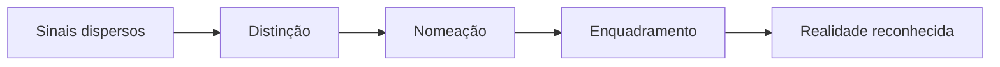

# ACJ-01 — Reconhecimento

> **Frase central:** antes de se mover em uma jornada, a audiência precisa poder ver o que até então permanecia difuso, naturalizado ou sem nome.

# 1 Definição

Reconhecimento é a arquitetura que torna perceptível e nomeável uma realidade relevante ainda difusa, fragmentada, naturalizada ou mal compreendida pela audiência. Seu movimento ocorre quando o conteúdo distingue sinais, revela relações e oferece linguagem suficiente para que algo passe de sensação ou ruído a objeto consciente de atenção.

Ela não exige que a pessoa já se reconheça pessoalmente naquela realidade, confie no produtor, experimente algo ou queira aprofundar-se. Seu resultado essencial é mais elementar: **“agora consigo ver e nomear o que está sendo apontado”**.

# 2 Propósito

O Reconhecimento cria um campo comum de realidade entre produtor e audiência. Ele permite que uma jornada comece sem exigir adesão prematura.

Seu propósito é:

- revelar fenômenos, tensões, padrões ou possibilidades ainda pouco percebidos;
- organizar sinais dispersos em uma leitura inteligível;
- oferecer linguagem para algo que era apenas sentido, repetido ou normalizado;
- deslocar explicações simplistas quando elas impedem uma leitura mais ampla;
- estabelecer um objeto comum de atenção a partir do qual outras ACJs possam operar;
- abrir curiosidade e disponibilidade para investigar, sem forçar identificação, vínculo ou ação.

Sem Reconhecimento suficiente, a campanha tende a falar sobre uma realidade que a audiência ainda não percebe, antecipando explicações, convites ou aprofundamentos para os quais ainda não existe campo.

# 3 Condições de uso

## 3.1 Indicações

O Reconhecimento é indicado quando:

- a audiência sente efeitos, mas ainda não percebe o padrão que os conecta;
- uma realidade foi normalizada e deixou de ser interrogada;
- os sinais existem, mas aparecem fragmentados ou atribuídos apenas a causas individuais;
- a campanha introduz uma lente, um paradigma ou uma distinção ainda pouco familiar;
- existe vocabulário insuficiente para nomear a experiência;
- a conversa pública está presa a uma explicação superficial;
- é necessário criar um ponto de entrada para pessoas em diferentes estágios da jornada;
- a audiência avançou anteriormente, mas precisa reconhecer uma nova camada, tema ou contexto.

## 3.2 Pré-condições

Para operar com integridade, o conteúdo precisa:

- apontar uma realidade observável ou uma hipótese explicitamente apresentada como tal;
- distinguir fatos, interpretações e inferências;
- oferecer linguagem clara sem empobrecer a complexidade;
- apresentar sinais, relações, exemplos ou evidências suficientes para sustentar o enquadramento;
- preservar espaço para que a audiência observe antes de concordar;
- manter coerência com os princípios, o repertório e o lugar de fala de Marcos e da Bee.

## 3.3 Contraindicações

O Reconhecimento não deve ser a arquitetura primária quando:

- a realidade já está claramente percebida e a necessidade é a pessoa localizar-se nela;
- a principal lacuna é confiança, reciprocidade ou qualidade de vínculo;
- a audiência precisa experimentar uma nova possibilidade, não apenas compreendê-la;
- já existe prontidão para integração, continuidade ou aprofundamento;
- a situação exige orientação prática imediata;
- o produtor não possui base suficiente para nomear a realidade sem especulação excessiva;
- a ideia depende de medo, choque ou exagero para parecer relevante.

Nesses casos, ACJ-02, ACJ-03, ACJ-04 ou ACJ-05 podem responder melhor à necessidade da jornada.

## 3.4 Contexto temporal

O Reconhecimento tende a ganhar prioridade:

- no início de campanhas que introduzem uma nova leitura de realidade;
- antes de conceitos complexos, ofertas ou experiências que exigem repertório prévio;
- quando a campanha alcança novos segmentos ou amplia distribuição;
- em momentos de mudança externa que tornam um padrão novamente relevante;
- depois de saturação narrativa, quando é preciso revelar outra camada do mesmo fenômeno;
- em reentradas, quando pessoas conhecidas encontram a jornada por um novo tema.

Sua presença deve diminuir quando a audiência demonstra que já domina a distinção e precisa de outro movimento.

# 4 Mecanismo de conexão

O Reconhecimento opera por **revelação orientada**: seleciona sinais relevantes, estabelece distinções, nomeia um padrão e oferece um enquadramento que torna a realidade observável sem fechá-la prematuramente.

| Elemento | Descrição |
|---|---|
| Estado de origem | A pessoa percebe efeitos, desconfortos, acontecimentos ou possibilidades, mas ainda não os organiza em uma realidade inteligível. |
| Operação relacional | O produtor dirige a atenção para sinais e relações relevantes, oferecendo distinção, linguagem e enquadramento. |
| Experiência favorecida | A audiência experimenta clareza inicial, surpresa reconhecível ou alívio por conseguir nomear algo antes difuso. |
| Deslocamento esperado | A realidade passa a ser vista como existente, relevante e digna de investigação. |
| Sinais iniciais | Adoção da linguagem, reformulação do problema, perguntas mais precisas, salvamentos e compartilhamentos contextualizados. |

O mecanismo pode ser sintetizado como:

# 5 Manifestações possíveis

| Natureza | Manifestações possíveis | Observações |
|---|---|---|
| Gesto autoral | observar, distinguir, nomear, revelar, tornar visível, reorganizar uma leitura | O produtor oferece acuidade, não superioridade. |
| Estrutura narrativa | contraste entre aparência e estrutura; sintomas que revelam um padrão; antes e depois da percepção; mito e realidade; paradoxo; pergunta reveladora | A narrativa deve abrir percepção, não fabricar suspense vazio. |
| Tipo de pauta | sinais de um fenômeno; padrões invisíveis; conceitos que faltavam; erros de enquadramento; mudanças de contexto; relações pouco percebidas | A pauta deve nomear algo específico o bastante para ser observado. |
| Experiência proposta | pergunta de observação; mapa simples; lista diagnóstica não clínica; comparação; lente para reler uma situação | Não exigir confissão, adesão ou exposição pessoal. |
| Interação ou convite | observar a própria realidade; identificar onde o fenômeno aparece; compartilhar com quem precisa da distinção; continuar investigando | O CTA deve ser proporcional ao estágio inicial da jornada. |
| Expressão visual | cenas de observação; detalhes contextuais; contraste visual; mapas, diagramas ou sequências que tornam relações visíveis | A imagem não deve dramatizar artificialmente o problema. |
| Adaptação por canal | carrossel de distinções; vídeo curto de enquadramento; artigo analítico; pergunta comentada; fala de abertura; fotografia contextual | O canal altera a densidade, não o movimento. |

## 5.1 Exemplos abstratos de formulação

- “Chamamos de falta de engajamento aquilo que pode ser perda de sentido.”
- “O conflito visível talvez seja apenas o lugar onde uma tensão sistêmica aparece.”
- “Nem todo cansaço vem do excesso de trabalho; parte dele nasce de sustentar uma forma de liderar que já perdeu vitalidade.”
- “Quando o discurso muda, mas as relações permanecem iguais, a transformação ainda não aconteceu.”

Esses exemplos demonstram o mecanismo de revelação. Não constituem pautas fixas nem fórmulas de copy.

# 6 Limites e desvios

## 6.1 O que Reconhecimento não é

Reconhecimento não é:

- alcance ou awareness de marca;
- chamar atenção por qualquer meio;
- repetir uma verdade genérica;
- explicar tudo sobre um tema;
- diagnosticar pessoas à distância;
- fazer a audiência admitir que possui um problema;
- induzir identificação emocional;
- construir intimidade ou confiança;
- apresentar uma solução ou convocar para ação.

## 6.2 Confusões com outras ACJs

| ACJ relacionada | Diferença essencial |
|---|---|
| ACJ-02 Identificação | Reconhecimento torna uma realidade visível; Identificação ajuda a pessoa a localizar-se nela. |
| ACJ-03 Conexão | Reconhecimento cria um objeto comum de atenção; Conexão constrói qualidade de vínculo e presença relacional. |
| ACJ-04 Experimentação | Reconhecimento amplia percepção; Experimentação permite viver, testar ou praticar uma possibilidade. |
| ACJ-05 Aprofundamento | Reconhecimento inaugura ou renova uma leitura; Aprofundamento amplia integração, densidade e continuidade. |

## 6.3 Falhas e simulações do movimento

| Desvio | Classe do problema | Sinal de alerta |
|---|---|---|
| Nomeação genérica | conteúdo | A frase parece verdadeira, mas não permite observar nada novo. |
| Choque sem distinção | execução | Há reação, mas a audiência não consegue explicar o que passou a ver. |
| Problema fabricado | conteúdo | O conteúdo exagera sintomas ou cria um inimigo para produzir urgência. |
| Diagnóstico indevido | atribuição | A ideia tenta localizar a pessoa antes de tornar a realidade suficientemente observável. |
| Explicação excessiva | conteúdo | A densidade fecha a investigação ou antecipa Aprofundamento. |
| Repetição saturada | contexto | A mesma distinção reaparece sem revelar nova camada. |
| Métrica confundida com movimento | contexto | Alcance, curtida ou clique são tratados como prova de reconhecimento. |
| Baixa distribuição | distribuição | A hipótese sobre a arquitetura é rejeitada sem exposição minimamente adequada. |

## 6.4 Saturação e riscos de integridade

Sinais de saturação:

- queda de atenção apesar de boa clareza;
- respostas que apenas repetem uma linguagem já dominada;
- percepção de que a campanha “só aponta problemas”;
- distância crescente entre reconhecer e encontrar um próximo movimento;
- excesso de variações sobre a mesma tensão sem ampliação de repertório.

Riscos de integridade:

- usar autoridade para impor uma leitura como verdade final;
- transformar complexidade sistêmica em rótulos totalizantes;
- explorar medo, culpa ou inadequação para gerar atenção;
- apropriar-se de dores da audiência sem oferecer precisão ou responsabilidade;
- apresentar inferências como fatos comprovados.

# 7 Resultados esperados

| Nível | Sinal esperado | Indicador possível | Janela | Limitação |
|---|---|---|---|---|
| Audiência | A pessoa consegue nomear a realidade, reformular o problema ou indicar o padrão percebido. | Comentários com linguagem própria, perguntas mais precisas, salvamentos e compartilhamentos contextualizados. | Imediata e curta. | Reação, alcance ou concordância não demonstram por si só reconhecimento. |
| Jornada | A realidade torna-se relevante o bastante para ser investigada, permitindo Identificação, Conexão, Experimentação ou Aprofundamento posteriores. | Continuidade de consumo, retorno ao tema, navegação para conteúdos relacionados e qualidade das respostas seguintes. | Curta a média. | Continuidade pode ser influenciada por distribuição, formato, timing e familiaridade prévia. |
| Negócio | Aumenta a consciência qualificada sobre o campo de atuação da Bee e a relevância de sua lente. | Crescimento de audiência qualificada, visitas a ativos de contexto, entrada em fluxos e aumento de demanda informada. | Média. | Conversão não é objetivo necessário nem prova isolada desta ACJ. |

# 8 Aprendizagem

## 8.1 Perguntas de aprendizagem

- Que realidades a audiência sente, mas ainda não consegue nomear?
- Quais distinções reorganizam a leitura sem exigir explicação excessiva?
- A audiência reconhece melhor por sinais concretos, contraste, conceito, pergunta ou enquadramento sistêmico?
- Que linguagem é adotada espontaneamente nas respostas?
- Em que ponto o Reconhecimento deixa de abrir percepção e passa a repetir algo já sabido?
- Quais temas pedem transição imediata para Identificação ou Experimentação?
- Que tipos de evidência ampliam credibilidade sem fechar a investigação?

## 8.2 Evidências e comparações

Evidências relevantes:

- respostas que reformulam o fenômeno com maior precisão;
- uso espontâneo da distinção apresentada;
- perguntas que avançam da existência do fenômeno para suas implicações;
- compartilhamentos acompanhados de contexto, não apenas volume;
- retorno a conteúdos que desenvolvem o mesmo campo;
- feedback de Marcos sobre clareza, verdade, potência e coerência autoral.

Comparações minimamente adequadas:

- conteúdos com tema e distribuição semelhantes, mas mecanismos de revelação diferentes;
- pergunta versus afirmação;
- exemplo concreto versus formulação conceitual;
- sintoma isolado versus relação sistêmica;
- nova distinção versus repetição de uma distinção conhecida.

## 8.3 Fatores de confusão

- tema em alta ou acontecimento externo;
- força emocional do assunto;
- notoriedade do produtor ou participação de terceiros;
- título sensacionalista;
- formato, qualidade visual ou distribuição atípica;
- familiaridade prévia da audiência com a linguagem;
- sobreposição com Identificação;
- CTA ou oferta inseridos cedo demais;
- tamanho e composição da amostra.

## 8.4 Hipóteses testáveis iniciais

| Hipótese | Variável | Controle | Sinal esperado | Critério de decisão |
|---|---|---|---|---|
| Sinais concretos antes do conceito favorecem Reconhecimento em audiências menos familiarizadas. | Ordem entre sinais e conceito. | Mesmo tema, promessa, canal e janela. | Maior reformulação espontânea do fenômeno. | Repetição do padrão em mais de uma ocorrência comparável. |
| Uma pergunta de observação produz mais Reconhecimento do que uma afirmação conclusiva em temas complexos. | Abertura interrogativa ou afirmativa. | Mesma distinção e densidade. | Respostas mais específicas e menos polarizadas. | Coerência entre respostas qualitativas e continuidade da jornada. |
| Enquadrar a relação sistêmica desloca melhor a culpa individual do que apenas listar sintomas. | Relação sistêmica versus lista. | Mesmo fenômeno e público. | Linguagem menos individualizante e perguntas sobre contexto e relações. | Padrão sustentado sem perda relevante de clareza. |

Essas hipóteses devem entrar no Registro Vivo quando utilizadas. Não constituem princípios consolidados da ACJ-01.

# 9 Integração operacional

| Objeto | Aplicação da ACJ-01 |
|---|---|
| Campanha | Participa do mix quando a jornada exige tornar uma realidade visível, introduzir nova lente ou criar ponto de entrada. |
| Ciclo | Ganha prioridade diante de lacunas de percepção, novos públicos, mudanças de contexto ou necessidade de reentrada. |
| Pauta | Orienta a escolha de algo que precisa ser distinguido, nomeado ou reenquadrado antes de ser desenvolvido. |
| Conteúdo-mãe | Registra realidade a revelar, estado de origem, distinção, mecanismo e sinal esperado. |
| Peças | Preservam a mesma realidade e distinção; se passam a localizar pessoalmente a audiência, podem tornar-se variante ACJ-02. |
| M01–M04 | Podem materializar o movimento conforme densidade e estrutura do conteúdo, sem equivalência fixa. |
| F01–F04 | Podem favorecer observação, contexto ou contraste, sem que um estilo fotográfico determine Reconhecimento. |
| Agenda | Deve observar repetição da mesma distinção, espaçar revelações e criar pontes para outros movimentos. |
| Resultados | Relacionam a linguagem e a qualidade das respostas à hipótese de reconhecimento, preservando fatores de confusão. |

## 9.1 Transições prováveis, não obrigatórias

- **Reconhecimento → Identificação:** quando a pessoa precisa localizar-se na realidade que passou a perceber.
- **Reconhecimento → Conexão:** quando a realidade percebida pede presença, confiança ou qualidade de vínculo.
- **Reconhecimento → Experimentação:** quando a melhor forma de compreender a implicação é testar outra possibilidade.
- **Reconhecimento → Aprofundamento:** quando já existe repertório e a nova distinção abre uma camada mais densa.
- **Reconhecimento → Reconhecimento:** quando outra camada precisa tornar-se visível antes de qualquer mudança de movimento.

# 10 Portões de qualidade

| Portão | Status | Evidência ou pendência |
|---|---|---|
| Q0 Identidade | atendido | Movimento definido como tornar uma realidade visível e nomeável. |
| Q1 Necessidade | atendido | Condições partem de lacuna perceptiva da jornada. |
| Q2 Mecanismo | atendido | Revelação orientada descrita por distinção, nomeação e enquadramento. |
| Q3 Fronteira | atendido | Diferenças para ACJ-02 a ACJ-05 explicitadas. |
| Q4 Manifestação | atendido | Repertório organizado por natureza, sem equivalências fixas. |
| Q5 Integridade | atendido | Limites, simulações, saturação e riscos registrados. |
| Q6 Evidência | atendido | Sinais e limitações descritos nos três níveis. |
| Q7 Aprendizagem | atendido | Perguntas, comparações, confundidores e hipóteses definidos. |
| Q8 Integração | atendido | Relação com os objetos atuais da Hive preserva fronteiras. |
| Q9 Governança | pendente | Exige validação de Marcos antes de consolidação como v1.0. |

# 11 Governança e histórico

| Versão | Data | Mudança | Evidência | Aprovação |
|---|---|---|---|---|
| 0.1 | 2026-09-29 | Primeira formulação completa a partir do Template Canônico. | Arquitetura inicial da Biblioteca ACJ. | pendente |

## 11.1 Critérios para evolução

- Ajustes de exemplos, canal ou redação podem ser tratados como execução ou revisão editorial.
- Mudanças em definição, condições, mecanismo, fronteiras ou resultados exigem hipótese registrada e validação humana.
- Manifestações recorrentes e distintas podem tornar-se variantes formais depois de teste.
- Nenhuma observação isolada autoriza ampliar ou restringir esta arquitetura.

# 12 Decisões propostas para validação

1. O resultado mínimo do Reconhecimento é tornar uma realidade visível e nomeável, não produzir identificação pessoal.
2. Reconhecimento cria um objeto comum de atenção, mas ainda não equivale a vínculo.
3. A revelação precisa apoiar-se em realidade observável ou hipótese explicitamente sinalizada.
4. Atenção, alcance, concordância e conversão não comprovam isoladamente que o movimento ocorreu.
5. Adoção de linguagem, reformulação do problema e qualidade das perguntas são sinais mais próximos do mecanismo.
6. O Reconhecimento pode aparecer em qualquer fase da jornada, inclusive como reentrada ou revelação de nova camada.
7. A arquitetura não deve usar choque, culpa ou medo como substitutos de distinção.
