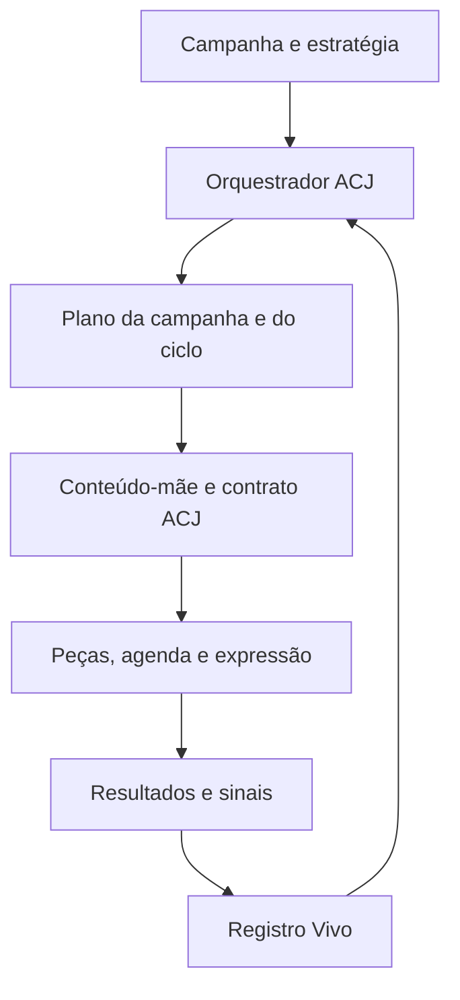

# Adendo Técnico de Integração ACJ à Hive

**Especificação funcional e técnica para Raul e equipe de desenvolvimento**

> **Decisão central:** a ACJ deve entrar como uma camada persistente e rastreável entre a estratégia da campanha e a seleção de pautas, conteúdos e expressões, sem substituir os objetos atuais da Hive.

# 1 Objetivo

Este adendo traduz a Biblioteca Arquiteturas de Conexão e Jornada em requisitos de implementação. Ele define:

- objetos novos ou ampliados;
- campos e relacionamentos mínimos;
- invariantes de negócio;
- serviços e eventos necessários;
- contratos de entrada e saída dos prompts;
- impactos nas telas e nos motores existentes;
- rastreabilidade de resultados e aprendizagem;
- sequência recomendada de implantação;
- critérios de aceite;
- decisões que precisam ser compatibilizadas com a arquitetura atual da Hive.

O documento não presume linguagem, framework, banco de dados ou provedor de IA. Os nomes técnicos são propostas semânticas e podem ser adaptados ao padrão do sistema, desde que a informação e as regras sejam preservadas.

# 2 Escopo

## 2.1 Incluído

- Biblioteca ACJ-01 a ACJ-05 como conhecimento versionado;
- ACJ-00 como governança não selecionável;
- Plano ACJ da Campanha;
- composição ACJ por fase;
- Plano ACJ do Ciclo;
- atribuição ACJ às ideias e conteúdos-mãe;
- herança e snapshot nas peças;
- contexto ACJ para M01–M04 e F01–F04;
- circulação na agenda;
- coleta de sinais e resultados;
- Registro Vivo de Aprendizagens ACJ;
- governança de validação e promoção de aprendizados.

## 2.2 Não incluído nesta etapa

- redesenho completo da estratégia de campanha;
- substituição das bibliotecas de território, narrativa, editoria, pauta, M01–M04 ou F01–F04;
- automação irrestrita de mudanças estruturais;
- inferência causal automática a partir de métricas de plataforma;
- criação automática de novas ACJs;
- reconstrução das telas sem validação do fluxo atual;
- definição da tecnologia de armazenamento antes da leitura do código e do modelo existentes.

# 3 Decisões funcionais já estabelecidas

1. ACJ é uma camada obrigatória entre estratégia e pauta.
2. ACJ-00 governa e não pode ser atribuída a conteúdos.
3. As ACJs selecionáveis são ACJ-01, ACJ-02, ACJ-03, ACJ-04 e ACJ-05.
4. As cinco ACJs não formam uma sequência linear obrigatória.
5. Mix estratégico e mix ACJ são eixos separados.
6. O Plano ACJ existe nos níveis campanha e ciclo.
7. Toda ideia ou conteúdo-mãe possui uma ACJ primária.
8. Uma ACJ secundária é opcional e limitada a uma.
9. O conteúdo-mãe é a fonte canônica da atribuição ACJ.
10. Peças herdam a atribuição e preservam snapshot histórico.
11. Mudança do movimento primário cria nova variante de conteúdo-mãe.
12. M01–M04 e F01–F04 recebem ACJ como contexto semântico, sem equivalência fixa.
13. Resultados observados não alteram automaticamente documentos ACJ.
14. Aprendizagens provisórias permanecem no Registro Vivo.
15. Ajustes estruturais, variantes oficiais e novas arquiteturas exigem validação humana.

# 4 Visão de integração



## 4.1 Princípio de acoplamento

A ACJ deve ser integrada como **metadado de decisão e governança**, não como nova editoria, tag decorativa ou texto solto no prompt.

Ela precisa:

- existir como dado estruturado;
- possuir versão e origem;
- acompanhar o conteúdo do planejamento ao resultado;
- ser legível pelos motores de recomendação;
- preservar histórico quando planos e definições mudarem;
- permitir consulta e análise sem reconstrução posterior por IA.

# 5 Mapa de impacto nos objetos atuais

| Objeto atual ou etapa | Alteração necessária | Tipo de impacto |
|---|---|---|
| Produto e contexto | Nenhuma mudança conceitual; fornecer contexto para diagnóstico da jornada. | leitura |
| Estratégia recomendada | Manter mix estratégico e acrescentar referência ao Plano ACJ. | extensão |
| Fases da campanha | Associar composição ACJ e estado relacional esperado por fase. | extensão |
| Ciclo | Criar Plano ACJ do Ciclo vinculado ao plano da campanha. | novo objeto ou extensão |
| Pauta ou ideia recomendada | Exibir ACJ primária, secundária opcional, movimento e papel na sequência. | extensão |
| Backlog | Permitir filtro, prioridade e cobertura por ACJ. | extensão |
| Conteúdo-mãe | Adicionar contrato ACJ canônico e versionado. | extensão obrigatória |
| Validação editorial | Verificar realização do mecanismo e fronteiras da ACJ. | nova validação |
| Peças | Herdar atribuição, registrar snapshot e desvios. | extensão obrigatória |
| Motor M01–M04 | Consumir ACJ como contexto de compatibilidade. | integração |
| Motor F01–F04 | Consumir ACJ como contexto de compatibilidade. | integração |
| Agenda | Considerar sequência, lacunas, saturação e espaçamento ACJ. | extensão |
| Resultados | Vincular sinais ao plano, conteúdo-mãe, peça e atribuição ACJ. | extensão obrigatória |
| Aprendizagem | Criar ou vincular entrada no Registro Vivo. | novo objeto |
| Base Hive | Receber apenas aprendizados validados e promovidos. | governança |

# 6 Modelo lógico proposto

O desenho abaixo é lógico. Raul deve mapear cada entidade para tabelas, documentos, agregados ou estruturas já existentes.

## 6.1 Entidades principais

| Entidade lógica | Responsabilidade | Cardinalidade principal |
|---|---|---|
| `acj_definition` | Metadados e versão de ACJ-01 a ACJ-05. | uma definição possui várias versões |
| `acj_campaign_plan` | Diagnóstico, mix, fases, sequências e recalibração da campanha. | uma campanha possui uma ou mais versões do plano |
| `acj_campaign_phase` | Composição e estado relacional por fase. | pertence a um plano de campanha |
| `acj_cycle_plan` | Mix e prioridades do ciclo. | pertence a campanha, ciclo e versão do plano |
| `acj_content_contract` | Atribuição e movimento do conteúdo-mãe. | um conteúdo-mãe possui versões do contrato |
| `acj_piece_snapshot` | Herança do contrato no momento da criação ou publicação. | uma peça possui um snapshot ativo e histórico preservável |
| `acj_result_observation` | Sinais da audiência, jornada e negócio com limitações. | liga resultado a campanha, ciclo, conteúdo e peça |
| `acj_learning_entry` | Entrada do Registro Vivo. | agrega evidências, testes e decisões |
| `acj_learning_evidence` | Evidência rastreável de uma entrada. | várias por aprendizagem |
| `acj_learning_decision` | Status, confiança, implicação, aprovação e destino. | histórico por aprendizagem |

## 6.2 O que pode ser extensão de entidades existentes

Se campanha, ciclo, conteúdo-mãe, peça, resultado e aprendizagem já existem, não é necessário duplicá-los. A recomendação é:

- criar entidades próprias apenas para dados com ciclo de vida e versionamento específicos;
- usar chaves estrangeiras ou referências estáveis para objetos atuais;
- evitar JSON opaco quando filtros, integridade ou analytics exigirem campos consultáveis;
- permitir campo estruturado flexível somente para evidências, limitações e notas que realmente variem;
- preservar auditoria de alterações e aprovações.

# 7 Dicionário mínimo de dados

## 7.1 `acj_definition`

| Campo | Tipo lógico | Regra |
|---|---|---|
| `acj_id` | enum/string | ACJ-01 a ACJ-05. ACJ-00 não selecionável. |
| `name` | string | Nome aprovado. |
| `version` | string | Versão do documento. |
| `status` | enum | draft; in_validation; active; deprecated. |
| `primary_question` | text | Pergunta central. |
| `state_from` | text | Estado de origem. |
| `state_to` | text | Estado desejado. |
| `mechanism` | text | Mecanismo de conexão. |
| `document_ref` | reference | Fonte documental versionada. |
| `effective_from` | datetime | Início de vigência. |
| `deprecated_at` | datetime nullable | Fim de vigência. |

O texto completo das ACJs pode permanecer no repositório de conhecimento. O banco precisa guardar os campos necessários para seleção, validação, rastreabilidade e analytics.

## 7.2 `acj_campaign_plan`

| Campo | Tipo lógico | Regra |
|---|---|---|
| `id` | uuid/string | Imutável. |
| `campaign_id` | reference | Obrigatório. |
| `version` | integer/string | Incremental. |
| `status` | enum | Conforme Template Operacional. |
| `audience_state` | structured text | Diagnóstico atual. |
| `journey_needs` | list | Necessidades relacionais priorizadas. |
| `target_mix` | map ACJ→decimal | Total 100% dentro da tolerância definida. |
| `sequence_hypotheses` | list/object | Hipóteses, segmento, confiança e observação. |
| `success_signals` | object | Audiência, jornada e negócio separados. |
| `recalibration_rules` | object | Gatilhos e limites. |
| `exclusions` | object | Movimentos e condições excluídos. |
| `created_by` | reference | Autor. |
| `approved_by` | reference nullable | Obrigatório para ativação. |
| `created_at` | datetime | Auditoria. |
| `approved_at` | datetime nullable | Auditoria. |

## 7.3 `acj_cycle_plan`

| Campo | Tipo lógico | Regra |
|---|---|---|
| `id` | uuid/string | Imutável. |
| `cycle_id` | reference | Obrigatório. |
| `campaign_plan_id` | reference | Obrigatório. |
| `campaign_plan_version` | string | Snapshot da origem. |
| `cycle_mix` | map ACJ→decimal | Total 100%. |
| `gaps` | list | Lacunas observadas. |
| `saturation_flags` | list | Saturações e evidências. |
| `priorities` | ordered list | Necessidade, ACJ, peso e justificativa. |
| `circulation_rules` | object | Ordem, espaçamento, pontes e conflitos. |
| `rationale` | text | Razão do plano e de desvios do mix-alvo. |
| `status` | enum | Conforme vocabulário. |
| `created_at` | datetime | Auditoria. |

## 7.4 `acj_content_contract`

| Campo | Tipo lógico | Regra |
|---|---|---|
| `id` | uuid/string | Imutável. |
| `mother_content_id` | reference | Obrigatório e único por versão ativa. |
| `version` | integer/string | Incrementar ao alterar movimento. |
| `campaign_plan_id` | reference | Origem do planejamento. |
| `cycle_plan_id` | reference | Origem operacional. |
| `acj_primary` | enum | ACJ-01 a ACJ-05; obrigatório. |
| `acj_secondary` | enum nullable | ACJ-01 a ACJ-05; diferente da primária. |
| `attribution_confidence` | enum | Escala aprovada. |
| `audience_state_from` | text | Obrigatório. |
| `journey_need` | text | Obrigatório. |
| `movement_to` | text | Obrigatório. |
| `connection_mechanism` | text | Obrigatório e coerente com a ACJ. |
| `authorial_gesture` | text | Gesto de Marcos. |
| `expected_experience` | text | Experiência favorecida. |
| `expected_response` | object | Sinais possíveis, sem promessa causal. |
| `failure_modes` | list | Falhas e desvios principais. |
| `expression_context` | object | Compatibilidade para M, F, tom e formato. |
| `source_acj_version` | string | Versão da definição usada na atribuição. |
| `status` | enum | draft; validated; active; superseded. |

## 7.5 `acj_piece_snapshot`

| Campo | Tipo lógico | Regra |
|---|---|---|
| `piece_id` | reference | Obrigatório. |
| `mother_content_id` | reference | Obrigatório. |
| `contract_id` | reference | Obrigatório. |
| `contract_version` | string | Snapshot. |
| `inherited_acj_primary` | enum | Cópia imutável para histórico. |
| `inherited_acj_secondary` | enum nullable | Cópia imutável. |
| `channel` | enum/reference | Canal da peça. |
| `format` | enum/reference | Formato. |
| `template_id` | reference nullable | M01–M04 ou estrutura futura. |
| `photo_style_id` | reference nullable | F01–F04 ou estrutura futura. |
| `cta_type` | enum/reference nullable | CTA utilizado. |
| `execution_deviation` | object nullable | Classe, descrição e justificativa. |
| `published_at` | datetime nullable | Publicação. |

## 7.6 `acj_result_observation`

| Campo | Tipo lógico | Regra |
|---|---|---|
| `id` | uuid/string | Imutável. |
| `campaign_id` | reference | Obrigatório. |
| `cycle_id` | reference nullable | Quando aplicável. |
| `mother_content_id` | reference | Obrigatório. |
| `piece_id` | reference nullable | Quando a observação for de peça. |
| `acj_primary_snapshot` | enum | Atribuição no momento da execução. |
| `audience_signals` | object | Sinais quantitativos e qualitativos separados. |
| `journey_results` | object | Progressão, prática, continuidade, integração. |
| `business_results` | object | Resultado comercial pertinente. |
| `exposure_context` | object | Alcance, mídia, canal, janela e público. |
| `limitations` | object | Dado ausente, contexto e comparabilidade. |
| `deviation_class` | enum | none; attribution; content; execution; distribution; context. |
| `learning_entry_id` | reference nullable | Vínculo com Registro Vivo. |

## 7.7 `acj_learning_entry`

Implementar conforme o Registro Vivo, preservando no mínimo:

- ID `ACJL-AAAA-NNN`;
- título;
- escopo e referências de origem;
- fato observado;
- contexto;
- fontes;
- evidências;
- padrão candidato;
- hipótese e alternativas;
- desenho do teste;
- status;
- confiança;
- classe de mudança;
- próxima ação;
- decisão e aprovação;
- destino e versão afetada;
- histórico de alterações.

# 8 Invariantes e validações de domínio

Estas regras devem ser aplicadas na camada de domínio ou serviço, não apenas no prompt ou na interface.

1. `acj_primary` é obrigatório para conteúdo-mãe elegível à produção.
2. `acj_primary` e `acj_secondary` só aceitam ACJ-01 a ACJ-05.
3. `acj_secondary` deve ser nula ou diferente da primária.
4. Um conteúdo não pode possuir mais de duas ACJs.
5. Mixes devem totalizar 100% dentro de tolerância técnica explícita.
6. Toda versão ativa do plano precisa preservar versões anteriores.
7. Plano de ciclo referencia uma versão específica do plano da campanha.
8. Contrato do conteúdo-mãe referencia plano da campanha, plano do ciclo e versão da ACJ usada.
9. Peça não pode editar a ACJ canônica do conteúdo-mãe.
10. Alteração do movimento primário exige novo contrato ou nova variante de conteúdo-mãe.
11. Publicação registra snapshot imutável do contrato.
12. Resultado sempre referencia o snapshot vigente na execução.
13. Promoção de aprendizagem exige status `validated`, aprovador e destino.
14. Consolidação exige nova versão do documento afetado.
15. Exclusão lógica ou arquivamento deve preservar rastreabilidade histórica.

# 9 Serviços ou capacidades necessárias

Os nomes abaixo são funcionais. Podem ser incorporados a serviços existentes.

| Capacidade | Entrada | Saída | Observação |
|---|---|---|---|
| `recommendCampaignAcjPlan` | estratégia, público, fase, histórico e restrições | plano recomendado com mix, fases, hipóteses e confiança | não ativa sem aprovação |
| `recalibrateCycleAcjPlan` | plano vigente, backlog, execução recente, sinais e contexto | mix do ciclo, prioridades, lacunas, saturações e justificativa | preserva plano anterior |
| `assignAcjToIdea` | ideia, necessidade, plano do ciclo e bibliotecas | primária, secundária opcional, movimento e confiança | máximo duas ACJs |
| `validateMotherContentAcj` | contrato e conteúdo-mãe | aderência, falhas, conflitos e revisão sugerida | não reescreve silenciosamente |
| `createPieceAcjSnapshot` | contrato ativo e especificação da peça | snapshot e orientação de manifestação | obrigatório antes da publicação |
| `validatePieceInheritance` | peça e snapshot | preservação, desvio ou necessidade de nova variante | bloqueia conflito grave |
| `recommendAcjCirculation` | agenda, mix do ciclo e backlog | ordem, espaçamento, pontes e reforços | não trata ACJ como sequência rígida |
| `classifyAcjResult` | sinais, exposição, contexto e contrato | observação estruturada, limitações e classe provável | não declara causalidade |
| `openLearningEntry` | observação e referências | entrada do Registro Vivo | pode iniciar sem hipótese |
| `recommendLearningTest` | entrada, alternativas e histórico | desenho de teste e critérios | requer validação quando houver risco |
| `promoteValidatedLearning` | entrada validada e aprovação | proposta de alteração versionada | nunca automática para estrutura |

# 10 Eventos de domínio recomendados

Caso a Hive utilize eventos, filas ou hooks, considerar:

| Evento | Momento | Consumidores possíveis |
|---|---|---|
| `campaign_strategy_approved` | Estratégia validada. | criação do Plano ACJ da Campanha |
| `acj_campaign_plan_approved` | Plano ACJ aprovado. | fases, ciclo, backlog e auditoria |
| `cycle_selected` | Ciclo iniciado ou selecionado. | recalibração do Plano ACJ do Ciclo |
| `idea_recommended` | Ideia criada ou priorizada. | atribuição preliminar de ACJ |
| `mother_content_created` | Conteúdo-mãe iniciado. | criação do contrato ACJ |
| `mother_content_validated` | Conteúdo aprovado. | liberação para desdobramento |
| `piece_created` | Peça gerada. | snapshot e validação de herança |
| `piece_scheduled` | Peça entra na agenda. | checagem de circulação e saturação |
| `piece_published` | Publicação confirmada. | congelamento do snapshot e janela de resultado |
| `result_window_closed` | Janela observável concluída. | estruturação de resultado e possível aprendizagem |
| `learning_entry_validated` | Aprendizagem aprovada. | promoção e versionamento |

Eventos não são obrigatórios se o sistema operar de modo síncrono, mas o ciclo de vida equivalente precisa existir.

# 11 Contratos de prompt

## 11.1 Princípios

- enviar ACJ como contexto estruturado, não apenas como documento longo;
- incluir versão da definição utilizada;
- separar fatos fornecidos de inferências solicitadas;
- exigir saída estruturada validável;
- limitar a resposta aos valores permitidos;
- solicitar confiança e justificativa curta;
- exigir alternativas quando a atribuição for ambígua;
- impedir que o modelo trate ACJ como editoria, funil ou template;
- impedir mapeamentos fixos entre ACJ, M01–M04 e F01–F04;
- instruir o modelo a interromper quando os dados forem insuficientes.

## 11.2 Contexto mínimo para o orquestrador de campanha

- estratégia aprovada;
- fase e objetivo;
- avatar ou audiência;
- produto e jornada existente;
- histórico relevante;
- mix estratégico;
- restrições;
- definições vigentes das cinco ACJs;
- regras da ACJ-00;
- feedback de Marcos aplicável;
- aprendizados validados da Base Hive.

## 11.3 Saída mínima do plano da campanha

```json
{
  "audience_state": "",
  "journey_needs": [],
  "target_mix": {
    "ACJ-01": 0,
    "ACJ-02": 0,
    "ACJ-03": 0,
    "ACJ-04": 0,
    "ACJ-05": 0
  },
  "phases": [],
  "sequence_hypotheses": [],
  "success_signals": {
    "audience": [],
    "journey": [],
    "business": []
  },
  "recalibration_rules": [],
  "exclusions": [],
  "confidence": "low",
  "human_decisions_required": []
}
```

## 11.4 Saída mínima da atribuição de conteúdo

```json
{
  "acj_primary": "ACJ-01",
  "acj_secondary": null,
  "audience_state_from": "",
  "journey_need": "",
  "movement_to": "",
  "connection_mechanism": "",
  "authorial_gesture": "",
  "expected_experience": "",
  "expected_response": [],
  "failure_modes": [],
  "alternative_considered": null,
  "confidence": "medium",
  "rationale": "",
  "human_decision_required": false
}
```

Os exemplos definem forma, não conteúdo. A equipe deve alinhar nomes e validação ao padrão técnico atual.

# 12 Integração com editorias, pautas e narrativas

## 12.1 Ordem de decisão recomendada

1. estratégia e função estratégica;
2. necessidade da jornada;
3. composição ou atribuição ACJ;
4. território e editoria compatíveis;
5. narrativa;
6. pauta ou ideia;
7. conteúdo-mãe;
8. manifestação por canal.

Na prática, ideias podem surgir antes da atribuição. Nesse caso, a Hive deve verificar se a ideia serve naturalmente à necessidade e à ACJ; não deve forçar uma classificação para preservar uma pauta fraca.

## 12.2 Regras do recomendador de pauta

O recomendador deve receber:

- prioridade do ciclo;
- lacuna ou saturação;
- ACJ desejada;
- estado de origem e deslocamento;
- territórios, editorias e narrativas permitidos;
- conteúdos recentes e concorrentes;
- limites de identidade e produção.

Deve devolver:

- ideia;
- ACJ primária;
- papel na sequência;
- justificativa;
- risco de simulação do movimento;
- compatibilidade editorial;
- confiança.

# 13 Integração com M01–M04 e F01–F04

## 13.1 Regra de seleção

Os motores visual e fotográfico devem considerar ACJ como uma dimensão adicional entre várias:

- intenção do conteúdo;
- densidade textual;
- canal e formato;
- tom;
- narrativa;
- gesto autoral;
- experiência proposta;
- disponibilidade e adequação de imagens;
- ACJ primária e secundária.

## 13.2 Saída recomendada do seletor

| Campo | Função |
|---|---|
| `recommended_option` | M ou F sugerido. |
| `compatibility_score` | Compatibilidade relativa, não verdade absoluta. |
| `compatibility_reason` | Como a opção ajuda a manifestar o movimento. |
| `risk` | Como pode enfraquecer ou simular a ACJ. |
| `alternatives` | Outras opções válidas. |
| `required_adjustments` | Enquadramento, cena, hierarquia ou linguagem necessários. |

Não criar tabela fixa “ACJ X = M Y” ou “ACJ X = F Y”. Padrões recorrentes podem ser aprendidos e validados posteriormente.

# 14 Integração com agenda

O agendador deve receber o Plano ACJ do Ciclo e verificar:

- mix planejado e realizado;
- concentração recente da mesma ACJ;
- lacunas e saturações;
- sequência provável e pontes;
- proximidade de eventos ou ofertas;
- conteúdos que competem pelo mesmo movimento;
- tempo necessário para Experimentação ou Aprofundamento;
- restrições de canal e distribuição.

O agendador deve recomendar, não impor, a ordem quando a decisão envolver narrativa estratégica ou identidade de Marcos.

# 15 Analytics e aprendizagem

## 15.1 Três camadas de resultado

| Camada | Exemplos | Uso |
|---|---|---|
| Audiência | linguagem das respostas, qualidade do diálogo, autolocalização, prática relatada, retorno. | observar sinais do movimento |
| Jornada | progressão, continuidade, participação, aplicação, integração, autonomia. | avaliar deslocamento ao longo do tempo |
| Negócio | lead, inscrição, compra, retenção, indicação. | avaliar contribuição comercial sem causalidade automática |

## 15.2 Comparabilidade

Toda leitura deve preservar, quando disponíveis:

- audiência exposta;
- canal e formato;
- alcance e investimento;
- período e frequência;
- posição na sequência;
- tema, narrativa e CTA;
- versão do contrato ACJ;
- eventos externos;
- desvio de execução.

## 15.3 Abertura automática de aprendizagem

A Hive pode sugerir uma entrada no Registro Vivo quando detectar:

- resposta inesperada;
- padrão repetido;
- contradição entre fontes;
- desvio recorrente;
- lacuna ou saturação persistente;
- manifestação nova;
- possível conflito de arquitetura.

A sugestão deve apresentar observação e contexto. Não precisa formular hipótese automaticamente se os dados ainda forem insuficientes.

# 16 Impacto nas telas atuais

| Tela ou fluxo | Alteração mínima recomendada | Exposição ao usuário |
|---|---|---|
| Tela 05 — Estratégia recomendada | Gerar ou preparar Plano ACJ em segundo plano. | Visão expandida opcional; não competir com a decisão estratégica. |
| Tela 07 — Estratégia definida | Vincular a campanha ao Plano ACJ aprovado. | Mensagem curta sobre arquitetura relacional e recalibração. |
| Após Tela 08 | Executar orquestração ACJ antes de pauta e backlog. | Preferencialmente invisível, salvo conflito. |
| Tela 09 — Pauta recomendada | Incluir ACJ primária, movimento e papel na jornada. | Chip ou resumo curto com expansão. |
| Backlog | Adicionar filtro e cobertura por ACJ. | Visualização de lacunas e concentração. |
| Conteúdo-mãe | Armazenar contrato completo. | Exibir síntese e permitir inspeção. |
| Tela 11 — Validação | Rodar validador de mecanismo e fronteiras. | Mostrar movimento, risco e decisão necessária. |
| Tela 12 — Produção visual | Enviar ACJ aos seletores M e F. | Mostrar justificativa da recomendação quando útil. |
| Tela 13 — Agenda | Verificar equilíbrio, ordem, pontes e saturação. | Alertas acionáveis, não painel excessivo. |
| Resultados | Estruturar sinais e limitações. | Síntese por conteúdo e jornada. |
| Aprendizagem | Criar e acompanhar Registro Vivo. | Área própria de investigação e decisão. |

# 17 Permissões e governança

| Ação | Hive | Marcos | Operação técnica |
|---|---:|---:|---:|
| Gerar plano recomendado | sim | consultar | manter serviço |
| Aprovar plano da campanha | não | sim | registrar aprovação |
| Recalibrar ciclo dentro das regras | sim | acompanhar | executar |
| Atribuir ACJ preliminar | sim | revisar quando necessário | persistir |
| Aplicar ajuste de execução | sim | pode revisar | executar |
| Alterar definição de ACJ | não | aprovar | versionar após aprovação |
| Formalizar variante | recomendar | aprovar | implementar |
| Criar nova arquitetura | investigar | aprovar | implementar após decisão |
| Promover aprendizagem | preparar | aprovar quando estrutural | registrar e versionar |

O sistema deve registrar ator, data, versão anterior e justificativa das decisões estruturais.

# 18 Estratégia de migração

## 18.1 Princípios

- não reclassificar automaticamente todo o histórico;
- não bloquear campanhas atuais durante implantação;
- iniciar com objetos novos em modo assistido;
- preservar compatibilidade com conteúdos sem ACJ;
- diferenciar `not_assigned`, `not_applicable` e `unknown`;
- evitar inferir ACJ histórica apenas pelo texto final;
- permitir adoção progressiva por campanha.

## 18.2 Dados existentes

| Situação | Tratamento recomendado |
|---|---|
| Campanha encerrada | Manter sem Plano ACJ; classificar apenas em estudo específico. |
| Campanha ativa | Criar plano inicial com indicação de adoção tardia e limites. |
| Conteúdo-mãe em produção | Permitir contrato ACJ antes do desdobramento. |
| Peça já publicada | Não exigir snapshot retroativo; registrar `legacy_unassigned`. |
| Resultado histórico | Usar como contexto, não como evidência ACJ automaticamente atribuída. |
| Aprendizado anterior | Migrar somente se houver origem, contexto e decisão recuperáveis. |

# 19 Sequência recomendada de implementação

## Fase 0 — Compatibilização técnica

- mapear entidades e fluxos atuais;
- localizar prompts, serviços, telas e analytics afetados;
- decidir armazenamento e versionamento;
- validar nomes, IDs e permissões;
- confirmar como bibliotecas `.md` são carregadas e versionadas.

**Saída:** mapa `estrutura atual → contrato ACJ` aprovado por Raul.

## Fase 1 — Núcleo de domínio em modo oculto

- cadastrar definições ACJ;
- implementar Plano ACJ da Campanha e do Ciclo;
- implementar contrato do conteúdo-mãe;
- aplicar invariantes e auditoria;
- gerar recomendações sem alterar a interface principal.

**Saída:** ACJ persistida e rastreável de ponta a ponta em ambiente de teste.

## Fase 2 — Pauta, conteúdo e validação

- integrar atribuição às ideias;
- adicionar contrato ao conteúdo-mãe;
- validar mecanismo e fronteiras;
- criar snapshot nas peças;
- detectar mudança de movimento.

**Saída:** produção preserva a intenção relacional.

## Fase 3 — Visual, fotografia e agenda

- enviar contexto ACJ aos motores M01–M04 e F01–F04;
- adicionar justificativa e riscos às recomendações;
- integrar sequência, lacuna e saturação à agenda.

**Saída:** expressão e circulação servem à jornada sem equivalências fixas.

## Fase 4 — Resultados e Registro Vivo

- vincular resultados aos snapshots;
- separar sinais de audiência, jornada e negócio;
- implementar entrada, evidência, teste, confiança e decisão;
- habilitar promoção validada.

**Saída:** ciclo completo de aprendizagem com rastreabilidade.

## Fase 5 — Interface e refinamento

- expor apenas sínteses acionáveis;
- observar carga cognitiva de Marcos;
- ajustar alertas, aprovações e visões;
- remover duplicidades com campos atuais;
- validar experiência em campanhas reais.

**Saída:** ACJ integrada ao uso cotidiano sem transformar a Hive em formulário.

# 20 MVP recomendado

Para validar o valor antes da implementação completa, o MVP deve incluir:

1. definições ACJ versionadas;
2. Plano ACJ simples da Campanha;
3. Plano ACJ simples do Ciclo;
4. ACJ primária e secundária no conteúdo-mãe;
5. estado de origem, deslocamento, mecanismo e resposta esperada;
6. herança e snapshot básico nas peças;
7. exibição na pauta e na validação do conteúdo;
8. contexto ACJ enviado aos seletores M e F;
9. registro manual assistido de observação e hipótese;
10. histórico de versão e aprovação.

Pode ficar para uma fase posterior:

- analytics avançado por ACJ;
- detecção automática de padrões;
- recomendação autônoma de testes;
- promoção semiautomática de aprendizados;
- dashboards complexos;
- reclassificação histórica.

# 21 Critérios de aceite

## 21.1 Domínio

- [ ] ACJ-00 não aparece como opção selecionável.
- [ ] Apenas ACJ-01 a ACJ-05 podem ser atribuídas.
- [ ] ACJ primária é obrigatória antes da produção final.
- [ ] ACJ secundária é opcional e diferente da primária.
- [ ] Mixes respeitam total e versão.
- [ ] Conteúdo-mãe é fonte canônica.
- [ ] Peças preservam snapshot.
- [ ] Mudança de movimento cria nova variante ou revisão explícita.

## 21.2 Fluxo

- [ ] Estratégia aprovada pode gerar Plano ACJ.
- [ ] Ciclo pode recalibrar o mix com justificativa.
- [ ] Pauta mostra papel relacional.
- [ ] Conteúdo-mãe registra contrato completo.
- [ ] Validação detecta incompatibilidades.
- [ ] M e F recebem contexto sem mapeamento fixo.
- [ ] Agenda considera lacuna, saturação e sequência.
- [ ] Resultado preserva contexto e limitações.

## 21.3 Governança

- [ ] Ajustes estruturais exigem aprovação humana.
- [ ] Versões anteriores permanecem recuperáveis.
- [ ] Toda consolidação aponta para entrada do Registro Vivo.
- [ ] Hipóteses rejeitadas ou inconclusivas não são apagadas.
- [ ] A Base Hive recebe apenas aprendizagem validada.

## 21.4 Experiência

- [ ] Marcos vê síntese e decisão, não todos os campos internos.
- [ ] A ACJ não duplica editoria, narrativa ou função estratégica.
- [ ] Alertas são acionáveis e proporcionais.
- [ ] A implementação não força sequência linear.
- [ ] A Hive interrompe quando falta evidência ou julgamento estratégico.

# 22 Testes essenciais

| Cenário | Resultado esperado |
|---|---|
| Tentativa de atribuir ACJ-00 | Rejeitada pelo domínio. |
| Primária e secundária iguais | Rejeitada. |
| Três ACJs no conteúdo | Rejeitada ou exige divisão da ideia. |
| Mix total diferente de 100% | Rejeitado fora da tolerância. |
| Peça altera movimento primário | Sinaliza nova variante; não salva como simples herança. |
| Mudança de plano após publicação | Snapshot publicado permanece inalterado. |
| Resultado comercial alto sem sinal relacional | Registra resultado sem declarar realização da ACJ. |
| Métrica baixa com distribuição insuficiente | Classifica limitação de distribuição antes de arquitetura. |
| Aprendizagem sem aprovação estrutural | Permanece no Registro Vivo. |
| Nova versão de ACJ | Conteúdos históricos preservam versão original; novos usam versão vigente. |
| Recomendação visual | Retorna compatibilidade e risco, sem equivalência fixa. |
| Dados insuficientes | Serviço interrompe ou devolve confiança baixa e decisão humana necessária. |

# 23 Observabilidade técnica

Registrar logs e métricas para:

- geração, aprovação e recalibração de planos;
- versão de definição ACJ utilizada;
- falhas de validação de domínio;
- alterações manuais e seus autores;
- divergência entre ACJ recomendada e aprovada;
- peças com desvio de execução;
- tempo entre conteúdo, publicação e janela de resultado;
- criação e evolução de entradas do Registro Vivo;
- erros de parsing ou validação de saída do modelo;
- frequência de intervenção humana;
- custo e latência das novas chamadas de IA.

Esses dados servem à confiabilidade do sistema e não devem ser confundidos com evidência de eficácia da arquitetura.

# 24 Segurança e integridade

- aplicar controle de acesso às decisões e aprovações;
- evitar que prompts recebam dados pessoais desnecessários;
- registrar consentimento e limites quando experiências envolverem relatos ou vulnerabilidade;
- impedir exposição indevida de feedback qualitativo;
- manter distinção entre observação interna e conteúdo publicável;
- não gerar inferências sensíveis sobre indivíduos ou segmentos sem base e autorização adequadas;
- permitir correção e contestação de interpretações;
- preservar auditoria sem tornar notas provisórias verdades permanentes.

# 25 Decisões que Raul precisa devolver

| Tema | Pergunta objetiva | Saída esperada |
|---|---|---|
| Modelo atual | Quais entidades existentes correspondem a campanha, fase, ciclo, ideia, conteúdo-mãe, peça, agenda, resultado e aprendizagem? | mapa de equivalência |
| Persistência | Quais objetos ACJ serão tabelas, documentos ou extensões? | decisão de modelagem |
| Versionamento | Como o sistema preserva versões e snapshots hoje? | padrão técnico |
| Prompts | Onde estão os prompts de estratégia, pauta, conteúdo, visual e validação? | mapa de integração |
| Orquestração | Existe serviço central ou pipeline por etapa? | ponto de inserção da ACJ-00 |
| Eventos | Quais gatilhos já existem e quais precisam ser criados? | desenho de fluxo |
| Interface | Quais telas e componentes correspondem ao fluxo descrito? | inventário de impacto |
| Analytics | Que dados de exposição, audiência, jornada e negócio já são persistidos? | análise de lacunas |
| Permissões | Como aprovações e alterações manuais são registradas? | regra de autorização |
| Base Hive | Como aprendizados validados entram no contexto futuro? | contrato de promoção |
| Biblioteca `.md` | Como documentos canônicos são carregados, indexados e atualizados? | estratégia de conhecimento |
| Rollout | Qual fase pode ser implementada primeiro sem quebrar o fluxo atual? | plano de entrega |

# 26 Entregável solicitado ao Raul

Raul deve devolver um documento curto contendo:

1. mapa da arquitetura atual afetada;
2. correspondência entre entidades atuais e objetos ACJ;
3. decisões de armazenamento e versionamento;
4. serviços, prompts e telas que serão alterados;
5. lacunas ou conflitos encontrados;
6. proposta de MVP;
7. sequência de implementação com dependências;
8. estimativa por fase;
9. perguntas que dependem de decisão de Marcos;
10. riscos técnicos e medidas de mitigação.

# 27 Histórico e versionamento

| Versão | Data | Mudança | Base | Aprovação |
|---|---|---|---|---|
| 0.1 | 2026-09-29 | Primeira especificação técnica da integração ACJ. | Integração ACJ, ACJ-00, Template Operacional e Registro Vivo. | pendente |

# 28 Portões de qualidade deste documento

| Portão | Status | Evidência ou pendência |
|---|---|---|
| Q0 Escopo | atendido | Incluídos domínio, fluxo, prompts, interface, analytics e aprendizagem. |
| Q1 Neutralidade técnica | atendido | Modelo lógico sem impor stack ou banco. |
| Q2 Integridade | atendido | Invariantes independem da IA e da interface. |
| Q3 Rastreabilidade | atendido | Versões, snapshots, resultados e aprendizagem permanecem vinculados. |
| Q4 Herança | atendido | Conteúdo-mãe canônico e peça como snapshot. |
| Q5 Governança | atendido | Autonomia, aprovação e consolidação foram separadas. |
| Q6 Implantação | atendido | MVP, fases, migração e critérios de aceite foram definidos. |
| Q7 Compatibilização | pendente | Raul deve mapear a especificação à arquitetura real da Hive. |
| Q8 Validação humana | pendente | Marcos valida decisões funcionais após retorno técnico. |

# 29 Decisões propostas para validação

1. A ACJ será persistida como dado estruturado, versionado e rastreável.
2. Invariantes serão aplicadas na camada de domínio, não apenas em prompts.
3. Planos, contratos e snapshots serão vinculados por IDs e versões estáveis.
4. O MVP começará em modo assistido, sem reclassificação automática do histórico.
5. A interface exibirá sínteses e decisões; o contrato completo permanecerá interno.
6. Resultados manterão separadas audiência, jornada, negócio, exposição e limitações.
7. A implantação seguirá núcleo de domínio, conteúdo, expressão, analytics e refinamento.
8. Raul devolverá o mapa de compatibilização antes da decisão final de modelagem.
