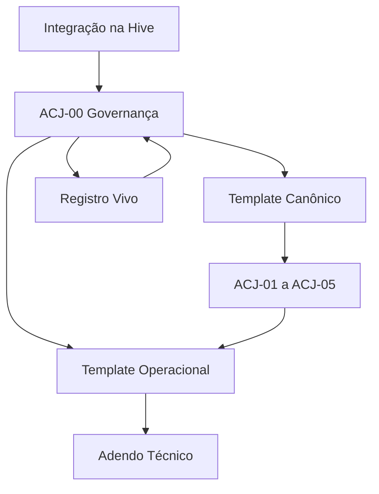

# Índice Mestre da Biblioteca ACJ

**Arquiteturas de Conexão e Jornada — pacote de arquitetura, operação, aprendizagem e integração técnica**

> **Função deste documento:** orientar leitura, validação, implementação e evolução da Biblioteca ACJ sem confundir documentos consolidados, documentos em validação e registros de aprendizagem.

# 1 Visão geral

A Biblioteca ACJ insere uma camada de orquestração relacional entre a estratégia da campanha e a seleção de editorias, pautas, conteúdos e expressões.

Ela responde a três perguntas complementares:

1. **Que movimento relacional a jornada precisa produzir?**
2. **Como esse movimento orienta campanha, ciclo, conteúdo-mãe e peças?**
3. **Como a Hive aprende com a execução sem transformar sinais isolados em princípios?**

O pacote atual possui **11 documentos**:

- 3 documentos consolidados de arquitetura e governança;
- 5 arquiteturas relacionais em validação;
- 3 documentos operacionais e técnicos em validação.

# 2 Mapa da biblioteca

| Camada | Pergunta central | Documentos |
|---|---|---|
| Integração | Onde a ACJ entra na Hive? | Integração ACJ à Arquitetura Hive |
| Governança | Como a jornada é orquestrada e evolui? | ACJ-00 |
| Padronização | Como cada arquitetura deve ser documentada? | Template Canônico |
| Biblioteca relacional | Que movimentos a Hive pode selecionar? | ACJ-01 a ACJ-05 |
| Operação | Como campanha, ciclo, conteúdo-mãe e peças recebem ACJ? | Template Operacional |
| Aprendizagem | Onde hipóteses e evidências permanecem antes de consolidação? | Registro Vivo |
| Implementação | Como integrar dados, serviços, prompts, telas e analytics? | Adendo Técnico |

# 3 Inventário dos documentos

## 3.1 Arquitetura consolidada

| Ordem | ID | Arquivo | Função | Versão | Status |
|---:|---|---|---|---:|---|
| 1 | HIVE-ACJ-INTEGRATION | `Integracao_ACJ_a_Arquitetura_Hive_v1.0.md` | Define a posição da ACJ na arquitetura atual, objetos impactados e decisões estruturais. | 1.0 | consolidado e canônico |
| 2 | ACJ-00 | `ACJ-00_Orquestracao_Aprendizagem_Evolucao_v1.0.md` | Governa composição, atribuição, observação, aprendizagem e evolução das ACJs. | 1.0 | consolidado e canônico |
| 3 | ACJ-TEMPLATE-CANONICAL | `Template_Canonico_ACJs_Individuais_v1.0.md` | Congela a estrutura comum de todas as arquiteturas individuais. | 1.0 | consolidado e canônico |

## 3.2 Arquiteturas relacionais em validação

| Ordem | ID | Arquivo | Movimento | Versão | Status |
|---:|---|---|---|---:|---|
| 4 | ACJ-01 | `ACJ-01_Reconhecimento_v0.1.md` | Tornar uma realidade relevante visível e nomeável. | 0.1 | em validação |
| 5 | ACJ-02 | `ACJ-02_Identificacao_v0.1.md` | Permitir que a pessoa se localize na realidade apresentada. | 0.1 | em validação |
| 6 | ACJ-03 | `ACJ-03_Conexao_v0.1.md` | Criar segurança, confiança, reciprocidade ou pertencimento. | 0.1 | em validação |
| 7 | ACJ-04 | `ACJ-04_Experimentacao_v0.1.md` | Produzir contato vivido e evidência própria sobre outra possibilidade. | 0.1 | em validação |
| 8 | ACJ-05 | `ACJ-05_Aprofundamento_v0.1.md` | Sustentar integração, complexidade, capacidade e autonomia. | 0.1 | em validação |

## 3.3 Operação, aprendizagem e implementação

| Ordem | ID | Arquivo | Função | Versão | Status |
|---:|---|---|---|---:|---|
| 9 | ACJ-RVA | `Registro_Vivo_Aprendizagens_ACJ_v0.1.md` | Registra observações, hipóteses, testes, evidências e decisões antes de consolidação. | 0.1 | em validação |
| 10 | ACJ-OPS-TEMPLATE | `Template_Operacional_Orquestracao_ACJ_v0.1.md` | Define os contratos de campanha, ciclo, conteúdo-mãe e peça. | 0.1 | em validação |
| 11 | ACJ-TECH-INTEGRATION | `Adendo_Tecnico_Integracao_ACJ_Hive_v0.1.md` | Traduz a arquitetura em modelo lógico, regras, serviços, prompts, telas, rollout e aceite. | 0.1 | em validação |

# 4 Ordem de leitura integral

Para compreender todo o sistema, seguir:

1. **Integração ACJ à Arquitetura Hive** — posição e impacto sistêmico;
2. **ACJ-00** — governança e aprendizagem;
3. **Template Canônico** — estrutura comum das arquiteturas;
4. **ACJ-01 a ACJ-05** — movimentos selecionáveis;
5. **Template Operacional** — contratos que levam a ACJ à execução;
6. **Registro Vivo** — investigação e promoção de aprendizados;
7. **Adendo Técnico** — implementação na Hive.

Essa ordem explica primeiro **por que e onde**, depois **o que**, em seguida **como operar** e finalmente **como implementar**.

# 5 Trilha curta para Raul

Raul não precisa iniciar pela leitura integral das cinco ACJs. A trilha recomendada é:

## Leitura principal

1. `Integracao_ACJ_a_Arquitetura_Hive_v1.0.md`
2. `Adendo_Tecnico_Integracao_ACJ_Hive_v0.1.md`
3. `Template_Operacional_Orquestracao_ACJ_v0.1.md`

## Consulta necessária

4. `ACJ-00_Orquestracao_Aprendizagem_Evolucao_v1.0.md`
5. `Registro_Vivo_Aprendizagens_ACJ_v0.1.md`

## Anexos de domínio

6. `ACJ-01_Reconhecimento_v0.1.md`
7. `ACJ-02_Identificacao_v0.1.md`
8. `ACJ-03_Conexao_v0.1.md`
9. `ACJ-04_Experimentacao_v0.1.md`
10. `ACJ-05_Aprofundamento_v0.1.md`
11. `Template_Canonico_ACJs_Individuais_v1.0.md`

**O que esperamos de Raul:** compatibilizar a especificação com a arquitetura real da Hive e devolver mapa de impacto, decisões de modelagem, proposta de MVP, sequência de implementação, estimativas, riscos e perguntas que dependem de Marcos.

# 6 Trilha de validação para Marcos

Marcos precisa validar o significado e os limites, não a solução técnica detalhada.

## 6.1 Arquiteturas individuais

Em cada ACJ-01 a ACJ-05, validar especialmente a seção **Decisões propostas para validação** e responder:

- o movimento está definido com precisão?
- a fronteira com as outras ACJs está clara?
- as manifestações preservam a identidade da Bee?
- os desvios e riscos foram corretamente limitados?
- os resultados esperados são realistas?
- existe alguma formulação que a Hive não deveria usar?

## 6.2 Operação

No Template Operacional, validar:

- separação entre mix estratégico e mix ACJ;
- ACJ primária obrigatória e secundária opcional;
- conteúdo-mãe como fonte canônica;
- grau de autonomia da Hive;
- situações que exigem decisão de Marcos;
- quantidade de informação visível na interface.

## 6.3 Aprendizagem

No Registro Vivo, validar:

- critérios de confiança;
- autoridade da Hive para ajustes de execução;
- necessidade de aprovação humana para mudanças estruturais;
- modo de registrar feedback de Marcos;
- regras para promover aprendizado à Base Hive.

## 6.4 Integração técnica

No Adendo Técnico, Marcos precisa aprovar apenas as decisões funcionais. Modelagem, serviços e arquitetura de software devem ser respondidos por Raul.

# 7 Dependências entre documentos

| Documento | Depende de | Alimenta |
|---|---|---|
| Integração ACJ | arquitetura atual da Hive | todos os demais |
| ACJ-00 | Integração ACJ | planos, contratos, Registro Vivo e evolução |
| Template Canônico | ACJ-00 | ACJ-01 a ACJ-05 |
| ACJ-01 a ACJ-05 | Template Canônico e ACJ-00 | seleção, conteúdo, expressão e aprendizagem |
| Template Operacional | ACJ-00 e ACJ-01 a ACJ-05 | planejamento, conteúdo-mãe, peças e resultados |
| Registro Vivo | ACJ-00 e resultados de execução | testes, decisões e novas versões |
| Adendo Técnico | Integração, ACJ-00, Template Operacional e Registro Vivo | implementação e rollout |
| Índice Mestre | todos os documentos | navegação, handoff e governança do pacote |

# 8 Hierarquia de autoridade

Quando houver conflito entre documentos, usar esta ordem:

1. decisões explícitas de Marcos sobre identidade, estratégia e princípios;
2. documento consolidado e canônico mais recente;
3. documento em validação mais recente;
4. aprendizagem validada ainda não consolidada;
5. aprendizagem provisória do Registro Vivo;
6. recomendação gerada pela Hive;
7. exemplo, hipótese ou manifestação possível.

Nenhum exemplo ou saída de IA pode contrariar um princípio consolidado sem tornar o conflito explícito e solicitar decisão.

# 9 Status e versionamento

| Status | Significado | Uso permitido |
|---|---|---|
| `consolidated` + `canonical: true` | Estrutura aprovada e vigente. | Base da operação e da implementação. |
| `in_validation` + `canonical: false` | Formulação completa ainda sujeita à validação. | Teste assistido e revisão; não tratar como verdade definitiva. |
| `draft` | Formulação incompleta. | Trabalho interno. |
| `deprecated` | Versão substituída. | Consulta histórica, não uso em novas decisões. |

## 9.1 Regras de evolução

- mudanças estruturais sempre geram nova versão;
- versões anteriores permanecem rastreáveis;
- ajustes editoriais não devem alterar silenciosamente o mecanismo;
- aprendizado provisório não muda documento consolidado;
- promoção exige evidência, decisão e aprovação adequadas;
- após validação, os documentos v0.1 devem ser revisados e publicados como v1.0;
- o Índice Mestre deve ser atualizado a cada criação, consolidação, substituição ou depreciação.

# 10 Matriz de aprovação pendente

| Documento | Validação principal | Aprovador | Próxima decisão |
|---|---|---|---|
| ACJ-01 | identidade, fronteiras e resultados | Marcos | promover ou revisar |
| ACJ-02 | identidade, fronteiras e resultados | Marcos | promover ou revisar |
| ACJ-03 | identidade, fronteiras e integridade relacional | Marcos | promover ou revisar |
| ACJ-04 | experiência, segurança e limites | Marcos | promover ou revisar |
| ACJ-05 | profundidade, autonomia e relação com jornadas avançadas | Marcos | promover ou revisar |
| Registro Vivo | governança de evidência e decisão | Marcos | aprovar estrutura operacional |
| Template Operacional | contratos e autonomia da Hive | Marcos + Raul | validar função e viabilidade |
| Adendo Técnico | compatibilidade e implementação | Raul; decisões funcionais por Marcos | devolver mapa técnico e MVP |
| Índice Mestre | completude do pacote | Marcos | aprovar handoff |

# 11 Entrega recomendada ao Raul

Enviar os 11 arquivos `.md` mantendo os nomes atuais. A mensagem de encaminhamento pode ser:

> Raul, desenvolvemos a nova Biblioteca Arquiteturas de Conexão e Jornada — ACJ. Ela entra entre a estratégia da campanha e a seleção de pautas e conteúdos, orientando o movimento relacional da jornada e sua aprendizagem. O pacote contém a arquitetura, as cinco ACJs, os contratos operacionais, o Registro Vivo e um adendo técnico. Sugiro começar pelo Índice Mestre e seguir a trilha curta indicada para você. Precisamos que devolva o mapa de compatibilização com a Hive atual, a proposta de MVP, as dependências, estimativas, riscos e as decisões que precisam voltar para mim.

# 12 Pacote mínimo para uma primeira reunião

Se não for adequado enviar toda a biblioteca antes da conversa, compartilhar inicialmente:

1. Índice Mestre;
2. Integração ACJ à Arquitetura Hive;
3. Adendo Técnico;
4. Template Operacional.

Manter ACJ-00, Registro Vivo e ACJ-01 a ACJ-05 disponíveis como anexos de consulta.

# 13 Sequência recomendada após o envio

1. Raul lê a trilha curta e mapeia a arquitetura atual.
2. Marcos valida as decisões propostas das ACJ-01 a ACJ-05.
3. Raul devolve compatibilização, lacunas, MVP e estimativas.
4. Marcos e Raul resolvem decisões de fronteira entre função e tecnologia.
5. Os documentos v0.1 recebem ajustes.
6. Marcos aprova as versões v1.0.
7. Raul implementa o núcleo ACJ em modo assistido.
8. A Hive executa uma campanha-piloto.
9. Resultados e hipóteses entram no Registro Vivo.
10. Aprendizados validados orientam a primeira evolução da biblioteca.

# 14 Critério de fechamento desta etapa

A fase de arquitetura documental estará concluída quando:

- os 11 documentos estiverem disponíveis e vinculados;
- Marcos tiver validado as decisões funcionais pendentes;
- Raul tiver devolvido o mapa de compatibilização técnica;
- conflitos entre arquitetura desejada e sistema atual estiverem explícitos;
- o MVP estiver definido;
- responsabilidades e sequência de implementação estiverem acordadas;
- os documentos aprovados forem promovidos para v1.0.

# 15 Histórico

| Versão | Data | Mudança | Aprovação |
|---|---|---|---|
| 0.1 | 2026-09-29 | Primeiro inventário completo da Biblioteca ACJ e definição das trilhas de leitura, validação e handoff. | pendente |

# 16 Decisões propostas para validação

1. O pacote oficial atual é composto pelos 11 documentos listados neste índice.
2. Os arquivos `.md` são as fontes canônicas; versões em outros formatos são apenas de apresentação.
3. A trilha curta de Raul começa por Integração, Adendo Técnico e Template Operacional.
4. Marcos valida significado, identidade, limites e autonomia; Raul valida compatibilidade e implementação.
5. Documentos v0.1 permanecem não canônicos até revisão e aprovação.
6. O retorno técnico de Raul antecede a definição final do MVP.
7. O Índice Mestre será atualizado sempre que a biblioteca mudar.
