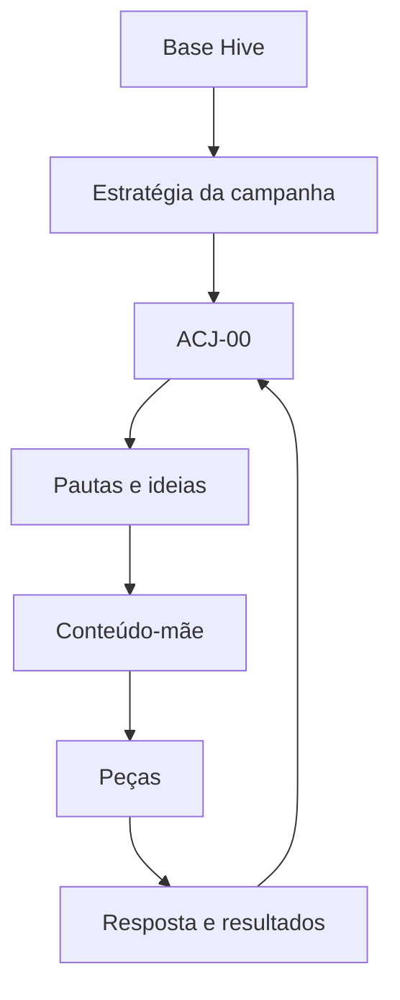

# Integração da Biblioteca Arquiteturas de Conexão e Jornada à Hive

**Documento de arquitetura e impacto no produto**

**Objetivo:** Definir onde a camada ACJ entra na arquitetura atual da Hive, quais estruturas passam a consumi-la e que decisões técnicas precisam ser tomadas antes da implementação.

**Destinatário:** Raul e equipe de desenvolvimento da Hive.

> **Decisão central:** A ACJ deve ser uma camada obrigatória de tradução entre a estratégia da campanha e a criação das pautas. Ela define o movimento relacional que cada conteúdo deve produzir e alimenta um ciclo próprio de aprendizagem.

# 1 Sumário executivo

A arquitetura atual da Hive já organiza a passagem da estratégia para ciclos, pauta, conteúdo-mãe, desdobramentos, agenda, resultados e aprendizagem. A lacuna está na passagem entre a necessidade estratégica e a ideia recomendada: a Hive sabe o que a campanha precisa alcançar, mas ainda não possui uma camada explícita para decidir que movimento deve ocorrer na relação com a audiência antes de escolher o conteúdo.

A Biblioteca Arquiteturas de Conexão e Jornada preenche essa lacuna. Ela não substitui funções estratégicas, territórios, narrativas, editorias, pautas ou templates. Ela organiza como essas estruturas serão combinadas para produzir Reconhecimento, Identificação, Conexão, Experimentação e Aprofundamento.

A ACJ-00 governa a combinação dessas arquiteturas, observa o que acontece e conduz sua evolução. As ACJ-01 a ACJ-05 são selecionáveis para campanhas, ciclos e conteúdos. A ACJ-00 não é selecionada como arquitetura de um conteúdo.

# 2 Onde a nova camada entra

No fluxo atual, depois que o usuário seleciona o ciclo, a Hive transforma necessidades estratégicas em ideias recomendadas. A ACJ entra exatamente nessa transição:

**Novo encadeamento operacional**

Ciclo selecionado → necessidades estratégicas → composição ACJ → necessidades relacionais → pautas e ideias → conteúdo-mãe → peças

# 3 Distinção entre as camadas

| **Camada**               | **Pergunta que responde**                                                                                          |
|--------------------------|--------------------------------------------------------------------------------------------------------------------|
| Estratégia da campanha   | O que precisa acontecer para o negócio, produto ou presença.                                                       |
| Função estratégica       | Se o conteúdo deve ampliar presença, posicionar, construir autoridade, gerar relacionamento ou aproximar produtos. |
| ACJ                      | Que movimento precisa acontecer na relação entre audiência, produtor e jornada.                                    |
| Território               | Sobre qual campo de significado a marca falará.                                                                    |
| Narrativa                | Por qual caminho interpretativo a ideia será conduzida.                                                            |
| Editoria                 | Como esse campo se organiza editorialmente de forma recorrente.                                                    |
| Pauta ou ideia           | Qual pensamento concreto vale desenvolver agora.                                                                   |
| Conteúdo-mãe             | Qual é a formulação intelectual completa, antes dos canais.                                                        |
| Template, formato e foto | Como esse pensamento ganha expressão visual e editorial.                                                           |

**Consequência prática** Autoridade não equivale a Aprofundamento; Relacionamento não equivale automaticamente a Conexão; M04 Convite e Jornada não equivale a ACJ-04 Experimentação; e F03 Campo Relacional não equivale a ACJ-03 Conexão. As estruturas podem ser compatíveis, mas não são intercambiáveis.

# 4 Modelo operacional da ACJ

## 4.1 Nível da campanha

A campanha recebe um Plano ACJ, governado pela ACJ-00. Esse plano registra o estado percebido da audiência, o movimento necessário, a proporção recomendada das arquiteturas, hipóteses de sequência, sinais esperados, limites e critérios de recalibração.

A distribuição ACJ deve ser um eixo separado do mix estratégico. O mix estratégico responde ao objetivo da comunicação; o mix ACJ responde à construção da jornada. A ACJ-00 cruza os dois e recomenda combinações por fase.

| **Eixo**        | **Exemplo**                                                                                        | **Função**                                                            |
|-----------------|----------------------------------------------------------------------------------------------------|-----------------------------------------------------------------------|
| Mix estratégico | Presença 35% \| Posicionamento 30% \| Autoridade 20% \| Relacionamento 10% \| Produtos 5%          | Define o que a campanha precisa produzir para o negócio e a presença. |
| Mix ACJ         | Reconhecimento 25% \| Identificação 25% \| Conexão 20% \| Experimentação 20% \| Aprofundamento 10% | Define o equilíbrio dos movimentos relacionais da jornada.            |

## 4.2 Nível do ciclo

Cada ciclo recebe sua própria composição ACJ. Ela considera o plano da campanha, conteúdos publicados e programados, saturação recente, lacunas da jornada, resposta da audiência e proximidade de eventos ou ofertas. Assim, o ciclo pode se afastar temporariamente da proporção geral sem abandonar a estratégia.

## 4.3 Nível da pauta e da ideia

Cada ideia deve ter uma ACJ primária obrigatória e, quando necessário, uma ACJ secundária. Mais de duas arquiteturas na mesma ideia enfraquecem a intenção, dificultam a escrita e tornam a aprendizagem pouco confiável.

## 4.4 Nível do conteúdo-mãe

A ACJ pertence canonicamente ao conteúdo-mãe. É nele que a Hive registra o estado percebido da audiência, o movimento desejado, o mecanismo de conexão, a resposta esperada e os principais desvios. O conteúdo-mãe continua channel free.

## 4.5 Nível das peças

As peças herdam a ACJ do conteúdo-mãe. Canal, formato, CTA e expressão visual podem variar, mas não devem alterar silenciosamente o movimento principal. Quando uma adaptação produz outro movimento relacional, ela deve ser tratada como uma nova variante de conteúdo, e não como simples desdobramento.

# 5 Responsabilidades da ACJ-00

A ACJ-00 é uma estrutura de governança. Ela não aparece como uma sexta arquitetura selecionável. Atua em quatro momentos:

1. **Planejamento:** recomenda composição, proporções, sequência e lacunas da jornada.
2. **Execução:** verifica se pauta, conteúdo-mãe e peças preservam o movimento definido.
3. **Leitura:** cruza feedback de Marcos, resposta da audiência e resultados da jornada.
4. **Evolução:** formula hipóteses, recomenda testes e classifica o nível de mudança necessário.

| **Classificação**         | **Quando usar**                                                                                           |
|---------------------------|-----------------------------------------------------------------------------------------------------------|
| Ajuste de execução        | A arquitetura está adequada, mas texto, CTA, formato, canal, timing ou peça não a realizou bem.           |
| Ajuste de arquitetura     | A definição ou as condições de uso precisam ser refinadas sem mudar a identidade da arquitetura.          |
| Nova variante             | Surge uma manifestação recorrente e distinta dentro de uma arquitetura existente.                         |
| Possível nova arquitetura | O padrão observado não cabe nas arquiteturas atuais e precisa ser testado antes de qualquer consolidação. |

**Regra de consolidação** Nenhuma observação isolada altera os documentos estruturais. Mudanças entram primeiro no Registro Vivo, são convertidas em hipótese, testadas e somente depois podem ser incorporadas às ACJs consolidadas.

# 6 Estruturas da Hive que precisam ser alteradas

| **Estrutura atual**    | **Alteração necessária**                                                                  |
|------------------------|-------------------------------------------------------------------------------------------|
| Estratégia recomendada | Acrescentar o Plano ACJ sem substituir o mix estratégico.                                 |
| Planejamento por fases | Distribuir arquiteturas ACJ ao longo da campanha e registrar hipóteses de sequência.      |
| Seleção do ciclo       | Fazer a ACJ-00 identificar lacunas, saturações e prioridades relacionais do período.      |
| Pauta recomendada      | Mostrar ACJ primária, movimento desejado e composição ACJ da pauta.                       |
| Backlog de ideias      | Permitir filtro e prioridade por ACJ, sem transformar ACJ em editoria.                    |
| Conteúdo-mãe           | Adicionar o contrato ACJ como metadado editorial obrigatório.                             |
| Validação de conteúdo  | Avaliar não apenas qualidade do texto, mas se o movimento pretendido foi realizado.       |
| Motor M01 a M04        | Receber ACJ como entrada semântica, sem equivalências fixas com templates.                |
| Motor F01 a F04        | Receber ACJ como sinal de compatibilidade, preservando as regras fotográficas existentes. |
| Peças e desdobramentos | Herdar ACJ e registrar qualquer desvio relevante de execução.                             |
| Agenda                 | Considerar equilíbrio, sequência, saturação e lacunas de ACJ na priorização.              |
| Resultados             | Relacionar respostas da audiência e resultados da jornada à ACJ utilizada.                |
| Aprendizagem           | Separar desempenho de execução de hipótese sobre arquitetura.                             |
| Base Hive              | Incorporar apenas aprendizados ACJ já validados.                                          |

# 7 Alterações previstas na experiência

| **Ponto da experiência**       | **Mudança**                                                                                                               |
|--------------------------------|---------------------------------------------------------------------------------------------------------------------------|
| Tela 05 Estratégia recomendada | Manter o mix estratégico. Disponibilizar a lógica ACJ em visão expandida, sem adicionar complexidade à decisão principal. |
| Tela 07 Estratégia definida    | Registrar que a campanha também possui uma arquitetura relacional e que ela será recalibrada com aprendizagem.            |
| Fluxo após a Tela 08           | Inserir ACJ-00 entre Estratégia e Plano ou Backlog na arquitetura interna.                                                |
| Tela 09 Pauta recomendada      | Adicionar ACJ primária por ideia e um resumo de como a pauta conduz a jornada.                                            |
| Tela 11 Validação do conteúdo  | Exibir de forma concisa o movimento pretendido e permitir que o feedback de Marcos qualifique essa leitura.               |
| Tela 12 Produção visual        | Enviar ACJ ao seletor de templates e estilos fotográficos como contexto semântico.                                        |
| Tela 13 Agenda                 | Usar ACJ na ordem de circulação, no equilíbrio do ciclo e nas recomendações de reforço.                                   |

# 8 Contrato mínimo de dados

Os nomes finais dos campos podem ser ajustados à arquitetura técnica. O contrato abaixo descreve a informação que precisa existir, independentemente da implementação.

| **Objeto**            | **Campos necessários**                                                                                                                   |
|-----------------------|------------------------------------------------------------------------------------------------------------------------------------------|
| Campanha              | acj_plan_version; audience_state; acj_target_mix; phase_mix; sequence_hypotheses; success_signals; recalibration_rules                   |
| Ciclo                 | campaign_acj_plan_id; cycle_acj_mix; gaps; saturation_flags; priorities; rationale                                                       |
| Ideia ou conteúdo-mãe | acj_primary; acj_secondary; audience_state_from; audience_state_to; connection_mechanism; expected_response; failure_modes               |
| Peça                  | mother_content_id; inherited_acj; execution_variant; channel; format; template_id; photo_style_id; cta_type; execution_deviation         |
| Resultado             | content_id; piece_id; campaign_id; cycle_id; acj_primary; audience_signals; journey_result; business_result                              |
| Aprendizagem          | observation; sources; evidence; hypothesis; proposed_test; decision_class; confidence; status; conclusion; implication; promotion_status |

**Princípio de herança** A fonte canônica da ACJ é o conteúdo-mãe. Peças e ativos podem manter um snapshot da ACJ para rastreabilidade e análise histórica, mas não devem se tornar fontes concorrentes.

# 9 Integração com os motores visual e fotográfico

As bibliotecas M01 a M04 e F01 a F04 permanecem como estão em sua identidade. A mudança ocorre no motor de seleção: a ACJ passa a ser mais uma dimensão de leitura do conteúdo.

| **Regra**                         | **Aplicação**                                                                                                                                  |
|-----------------------------------|------------------------------------------------------------------------------------------------------------------------------------------------|
| Compatibilidade, não equivalência | Uma ACJ pode favorecer alguns templates ou estilos, mas nunca determinar sozinha a escolha.                                                    |
| Seleção multidimensional          | A decisão continua considerando autoria, densidade, estrutura cognitiva, relacionalidade, futuro, ação, intimidade e necessidade de evidência. |
| Preservação da verdade            | Nenhuma necessidade de Conexão ou Experimentação autoriza fabricar clientes, eventos, relações ou resultados.                                  |
| Aprendizagem separada             | A Hive deve distinguir falha da ACJ, falha do conteúdo e falha da execução visual.                                                             |

# 10 Registro Vivo de Aprendizagens ACJ

O Registro Vivo deve existir separado dos documentos consolidados. Ele recebe observações provisórias e mantém rastreabilidade entre conteúdo, evidência, hipótese, teste e decisão. Sua lógica preserva a sequência:

dado → observação → hipótese → teste → aprendizagem → princípio consolidado

| **Bloco**     | **Conteúdo**                                                                        |
|---------------|-------------------------------------------------------------------------------------|
| Identificação | registro_id; data; campanha; ciclo; conteúdo; peça; ACJ utilizada                   |
| Fontes        | feedback de Marcos; resposta da audiência; resultado da jornada                     |
| Evidência     | o que foi observado; comparação; volume; contexto; limitações                       |
| Interpretação | padrão candidato; hipótese; confiança atual                                         |
| Teste         | o que mudar; o que preservar; duração; critério de decisão                          |
| Decisão       | ajuste de execução; ajuste de arquitetura; nova variante; possível nova arquitetura |
| Consolidação  | status; conclusão; implicação; documento afetado; promovido ou não                  |

# 11 Riscos e regras de proteção

1. Não transformar a ACJ em funil rígido. As cinco arquiteturas são movimentos possíveis, não etapas obrigatórias e lineares para toda pessoa.
2. Não escolher a ACJ depois que a pauta já existe. Isso a reduziria a uma etiqueta retrospectiva e impediria que orientasse a gênese do conteúdo.
3. Não medir todas as arquiteturas pelos mesmos indicadores. Cada ACJ precisa de sinais coerentes com seu mecanismo e com o estágio da jornada.
4. Não permitir que a ACJ substitua editorias, territórios ou narrativas. Ela deve atravessá-los como intenção relacional.
5. Não consolidar mudanças estruturais a partir de um caso isolado. Aprendizagens entram primeiro no Registro Vivo e exigem validação.
6. Não usar a mesma palavra de forma ambígua na interface e nos dados. Sempre preservar os prefixos ACJ, M e F quando houver risco de confusão.

# 12 Arquitetura documental recomendada

A documentação deve ser construída nesta ordem para evitar que as ACJs individuais nasçam desconectadas do produto:

1. **Constituição e Integração da Biblioteca ACJ:** precedência, herança, objetos, regras comuns e relação com as demais bibliotecas.
2. **ACJ-00:** Orquestração, Aprendizagem e Evolução da Jornada.
3. **Template canônico das ACJs individuais.**
4. **ACJ-01 a ACJ-05:** Reconhecimento, Identificação, Conexão, Experimentação e Aprofundamento.
5. **Registro Vivo de Aprendizagens ACJ.**
6. **Adendo técnico de integração:** campanha, conteúdo-mãe, agenda, analytics e motores de seleção.

# 13 O que precisamos validar com Raul

Antes de iniciar as fichas individuais e a implementação, precisamos validar:

- se a ACJ pode ser inserida como camada explícita entre campanha ou ciclo e pauta, sem quebrar o fluxo atual;

- quais entidades, tabelas, serviços, prompts e telas atuais serão impactados;

- como representar o Plano ACJ da campanha, a composição do ciclo e a herança pelo conteúdo-mãe;

- como manter os dois eixos de distribuição, mix estratégico e mix ACJ, sem gerar duplicidade ou conflito;

- como registrar sinais e resultados por ACJ sem depender apenas de métricas de alcance ou conversão;

- qual sequência técnica permite implementar primeiro a inteligência estrutural e depois sua exposição na interface.

**Resultado esperado desta validação** Um desenho técnico mínimo para incorporar a ACJ ao núcleo da Hive, preservando a arquitetura atual e permitindo que campanha, conteúdo, expressão e aprendizagem passem a operar como um sistema único.
