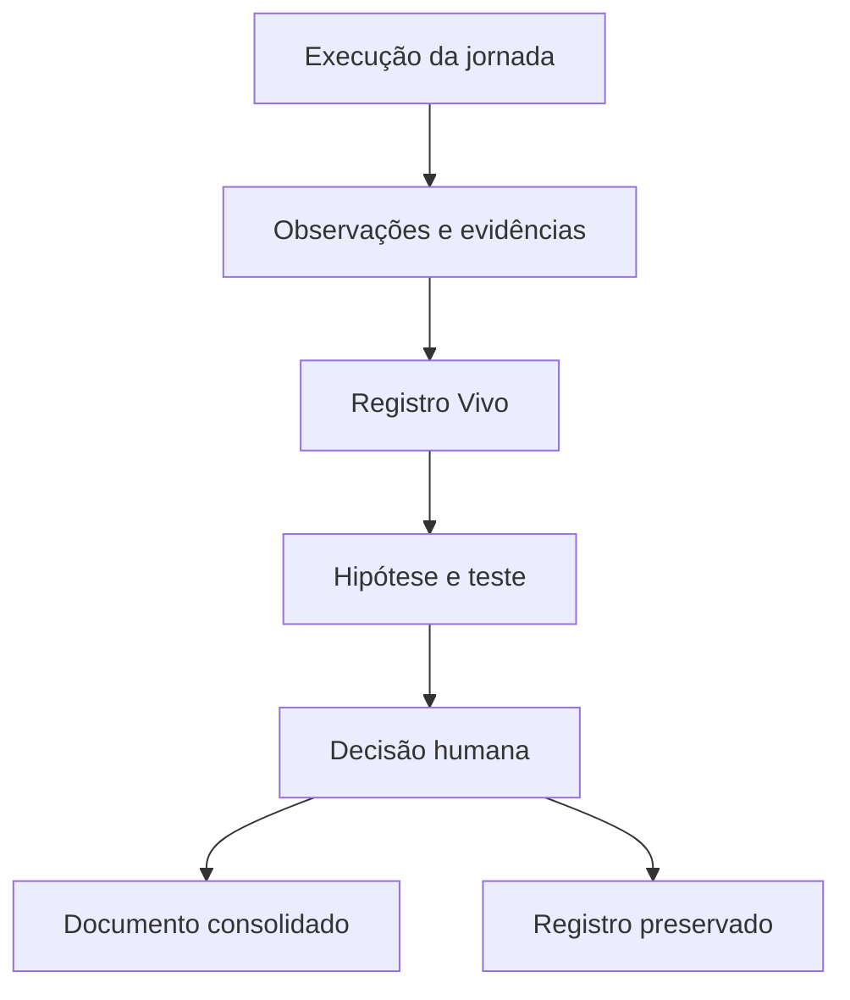

# Registro Vivo de Aprendizagens ACJ

**Documento operacional de investigação, teste e decisão da Biblioteca Arquiteturas de Conexão e Jornada**

> **Princípio central:** o Registro Vivo preserva o que a Hive está aprendendo sem transformar observações prematuras em verdades estruturais.

# 1 Função do registro

O Registro Vivo é a memória operacional da aprendizagem ACJ. Ele reúne observações, feedbacks, padrões candidatos, hipóteses, testes, evidências, interpretações e decisões produzidos durante campanhas, ciclos, conteúdos-mãe e peças.

Sua função é criar uma zona segura entre **o que aconteceu** e **o que será incorporado à arquitetura da Hive**.

O Registro Vivo:

- recebe feedback de Marcos, resposta da audiência e resultados da jornada;
- preserva a origem e o contexto de cada evidência;
- distingue fato observado, interpretação, hipótese e decisão;
- evita que um resultado isolado altere prematuramente uma ACJ;
- organiza testes comparáveis e critérios de decisão;
- classifica se o aprendizado pede ajuste de execução, ajuste de arquitetura, nova variante ou investigação de nova arquitetura;
- mantém hipóteses rejeitadas ou inconclusivas para evitar repetição de erros;
- encaminha apenas aprendizados validados para documentos consolidados e para a Base Hive.

# 2 Posição na arquitetura da Hive

O Registro Vivo é governado pela ACJ-00 e permanece separado das ACJs consolidadas.

| Camada | Função | Natureza do conteúdo |
|---|---|---|
| Execução | Produzir conteúdos, interações e resultados. | Operacional. |
| Registro Vivo | Investigar o que os resultados podem significar. | Provisória, rastreável e evolutiva. |
| Documentos ACJ | Preservar definições, mecanismos, fronteiras e decisões validadas. | Consolidada e versionada. |
| Base Hive | Disponibilizar aprendizados aprovados para decisões futuras. | Validada e reutilizável. |

Nenhuma entrada no Registro Vivo altera, por si só, ACJ-00, ACJ-01, ACJ-02, ACJ-03, ACJ-04 ou ACJ-05.

# 3 Princípios de integridade

## 3.1 Fato antes de explicação

O registro deve separar:

1. o que foi observado;
2. o que pode ter contribuído para o resultado;
3. o que será testado;
4. o que pode ser decidido depois do teste.

## 3.2 Evidência contextualizada

Todo dado precisa manter vínculo com campanha, fase, público, canal, conteúdo-mãe, peça, data e condições relevantes. Um número sem contexto não constitui aprendizagem.

## 3.3 Três fontes complementares

| Fonte | Contribuição | Limite |
|---|---|---|
| Feedback de Marcos | Coerência, autenticidade, potência percebida, desconfortos e julgamento estratégico. | Não substitui a resposta da audiência nem o resultado da jornada. |
| Resposta da audiência | Atenção, linguagem, reconhecimento, identificação, diálogo, prática e comportamento. | Pode ser afetada por canal, distribuição, contexto, incentivo e seleção. |
| Resultados da jornada | Progressão, continuidade, participação, conversão, retenção, aprendizagem e impacto. | Não comprova isoladamente o mecanismo relacional que produziu o resultado. |

## 3.4 Prudência proporcional

- uma ocorrência gera observação, não princípio;
- repetição gera padrão candidato, não causalidade;
- correlação orienta investigação, não prova arquitetura;
- ausência de resultado não prova inadequação da ACJ;
- desempenho superior de uma peça não prova superioridade da arquitetura;
- confiança deve crescer apenas com consistência, comparação e controle de explicações alternativas.

## 3.5 Memória sem apego

Entradas rejeitadas, inconclusivas ou superadas permanecem preservadas com seu status e justificativa. O objetivo não é defender hipóteses anteriores, mas evitar perda de contexto e reaprendizagem desnecessária.

# 4 Unidade de registro

Cada aprendizagem candidata recebe uma entrada própria e um identificador único.

**Padrão de identificação:** `ACJL-AAAA-NNN`

Exemplo: `ACJL-2026-001`.

Uma entrada deve tratar de **uma observação central ou uma hipótese principal**. Evidências relacionadas podem ser agregadas à mesma entrada; movimentos diferentes devem gerar registros distintos e vinculados.

## 4.1 Campos obrigatórios

| Bloco | Campo | Regra |
|---|---|---|
| Identidade | ID | Único e imutável. |
| Identidade | Título provisório | Descritivo, sem antecipar conclusão. |
| Identidade | Data de abertura e responsável | Sempre preenchidos. |
| Escopo | ACJ relacionada | Uma ou mais entre ACJ-01 e ACJ-05; pode ser `a determinar`. |
| Escopo | Objeto observado | Campanha, ciclo, conteúdo-mãe, peça, agenda, audiência ou resultado. |
| Escopo | Referências | IDs ou links para os objetos de origem. |
| Observação | Fato observado | Descrição sem atribuição causal. |
| Observação | Contexto | Público, fase, canal, período, formato, distribuição e fatos externos relevantes. |
| Evidência | Fonte | Marcos, audiência ou resultado da jornada. |
| Evidência | Evidência disponível | Quantitativa, qualitativa ou mista, com origem rastreável. |
| Investigação | Padrão candidato | Relação ou repetição que merece investigação. |
| Investigação | Hipótese | Explicação testável; pode ficar vazia no estado inicial. |
| Investigação | Alternativas | Outras explicações plausíveis. |
| Teste | Variável e controle | O que muda e o que permanece comparável. |
| Teste | Sinais esperados | Evidências que fortaleceriam ou enfraqueceriam a hipótese. |
| Teste | Janela | Período, ciclos ou número mínimo de ocorrências. |
| Decisão | Tipo de implicação | Execução, arquitetura, variante ou possível nova arquitetura. |
| Decisão | Status | Estado atual do registro. |
| Decisão | Confiança | Muito baixa, baixa, média, alta ou muito alta. |
| Decisão | Próxima ação | Ação, responsável e prazo ou condição de retomada. |
| Governança | Aprovação | Quem avaliou, quando e qual foi a decisão. |
| Governança | Destino | Documento ou base afetada após validação. |

# 5 Estados do registro

| Status | Significado | Próximo movimento permitido |
|---|---|---|
| Observação aberta | Há um fato relevante ainda sem explicação candidata. | Complementar contexto, buscar ocorrências e formular hipótese. |
| Hipótese formulada | Existe explicação testável e alternativas registradas. | Desenhar e aprovar teste. |
| Em teste | Variável, controle, janela e sinais foram definidos e o teste está em curso. | Coletar evidências sem alterar o critério depois do resultado. |
| Aprendizagem provisória | O padrão ganhou sustentação, mas ainda não autoriza mudança estrutural. | Repetir, ampliar contexto ou preparar validação. |
| Validada | Evidência e julgamento humano sustentam uma recomendação. | Aplicar decisão aprovada e definir destino. |
| Consolidada | A mudança foi incorporada a um documento versionado ou à Base Hive. | Encerrar mantendo rastreabilidade. |
| Rejeitada | A hipótese foi enfraquecida ou contradita de forma suficiente. | Encerrar e preservar justificativa. |
| Inconclusiva | A evidência foi insuficiente, conflitante ou inviável de testar. | Encerrar ou reabrir quando surgir nova evidência. |
| Suspensa | O teste perdeu prioridade ou depende de condição futura. | Registrar condição explícita de retomada. |

## 5.1 Transições permitidas

- Observação aberta → Hipótese formulada ou Inconclusiva;
- Hipótese formulada → Em teste, Suspensa, Rejeitada ou Inconclusiva;
- Em teste → Aprendizagem provisória, Rejeitada, Inconclusiva ou Suspensa;
- Aprendizagem provisória → Em teste, Validada, Rejeitada ou Inconclusiva;
- Validada → Consolidada;
- Suspensa → Hipótese formulada ou Em teste;
- qualquer estado pode receber novas evidências sem apagar o histórico anterior;
- registros encerrados só podem ser reabertos com justificativa e nova evidência.

# 6 Classificação da causa provável

Antes de atribuir um resultado à ACJ, a Hive deve testar explicações nas classes abaixo.

| Classe | Pergunta de diagnóstico | Exemplos |
|---|---|---|
| Atribuição | A ACJ escolhida correspondia ao movimento realmente necessário? | ACJ primária inadequada, secundária concorrente, salto de jornada. |
| Conteúdo | A ideia e a formulação realizaram o mecanismo da ACJ? | Tese fraca, exemplo genérico, falta de tensão, prática decorativa. |
| Execução | A peça preservou o contrato do conteúdo-mãe? | Copy, ritmo, imagem, CTA, facilitação ou adaptação incoerente. |
| Distribuição | O conteúdo chegou às pessoas adequadas em condições comparáveis? | Alcance, canal, horário, frequência, mídia ou segmentação. |
| Contexto | Houve fator externo capaz de alterar a resposta? | Evento, sazonalidade, concorrência, agenda, clima social ou composição da amostra. |

Uma entrada pode conter mais de uma classe candidata. A classificação `arquitetura` não deve ser usada como atalho causal: mudanças na arquitetura decorrem da decisão final, depois da investigação dessas classes.

# 7 Classificação da decisão

| Tipo | Quando usar | Autoridade |
|---|---|---|
| Ajuste de execução | A arquitetura permanece válida; muda-se forma, canal, ritmo, exemplo, CTA, facilitação ou distribuição. | Hive pode recomendar e aplicar dentro dos limites aprovados. |
| Ajuste de arquitetura | Definição, mecanismo, condições, fronteiras ou resultados de uma ACJ precisam ser revistos. | Exige validação humana antes de alterar o documento. |
| Nova variante | Surge uma manifestação recorrente e distinta, ainda pertencente a uma ACJ existente. | Hive recomenda; humano aprova formalização. |
| Possível nova arquitetura | O movimento observado não é explicado adequadamente pelas ACJs atuais. | Abre investigação estrutural; criação exige validação humana explícita. |
| Sem mudança | O resultado não exige alteração ou já está explicado pela estrutura vigente. | Registrar justificativa e encerrar. |

# 8 Escala de confiança

| Confiança | Condição típica | Uso permitido |
|---|---|---|
| Muito baixa | Impressão isolada, dado incompleto ou contexto desconhecido. | Registrar e observar. |
| Baixa | Uma ocorrência bem descrita ou sinais frágeis. | Formular hipótese e buscar comparação. |
| Média | Padrão repetido com evidências convergentes, mas alternativas relevantes permanecem. | Testar em novo contexto ou preparar aprendizagem provisória. |
| Alta | Padrão repetido, comparação adequada e explicações alternativas suficientemente controladas. | Recomendar validação e decisão. |
| Muito alta | Evidência consistente em contextos diferentes, com mecanismo coerente e validação humana. | Consolidar conforme governança. |

Confiança não deve ser calculada apenas pelo número de ocorrências. Qualidade, independência, contexto e convergência das evidências importam mais do que volume bruto.

# 9 Protocolo de registro das três fontes

## 9.1 Feedback de Marcos

Registrar separadamente:

- fala ou orientação original, quando relevante;
- contexto em que foi dada;
- interpretação provisória da Hive;
- implicação possível;
- decisão confirmada por Marcos.

Uma preferência de identidade ou princípio estratégico expressa por Marcos pode orientar imediatamente a execução, mas sua generalização para a arquitetura deve ser explicitamente decidida.

## 9.2 Resposta da audiência

Registrar, quando disponível:

- comportamento observado;
- linguagem espontânea utilizada;
- qualidade da resposta, e não apenas volume;
- segmento ou condição de entrada;
- exposição, alcance e distribuição;
- presença de incentivo, pressão ou seleção;
- diferenças entre resposta pública, privada e comportamental.

## 9.3 Resultados da jornada

Registrar, conforme o objetivo:

- progressão entre conteúdos ou experiências;
- participação, conclusão e retorno;
- qualidade das perguntas e aplicações;
- conversão e retenção;
- transferência para outros contextos;
- evidências de autonomia;
- resultados de negócio pertinentes;
- janela em que o resultado pode ser observado.

Métricas de plataforma são sinais, não equivalentes diretos de Reconhecimento, Identificação, Conexão, Experimentação ou Aprofundamento.

# 10 Protocolo de teste

Todo teste deve registrar antes da execução:

1. hipótese principal;
2. explicações alternativas relevantes;
3. variável que será modificada;
4. elementos que devem permanecer constantes;
5. unidade de comparação;
6. sinais que fortalecem a hipótese;
7. sinais que a enfraquecem;
8. janela de observação;
9. condição de interrupção por risco ou inconsistência;
10. decisões possíveis ao final.

## 10.1 Testes aceitáveis

- comparação entre conteúdos de contexto semelhante;
- repetição deliberada em mais de um ciclo;
- variação de uma manifestação preservando a mesma ACJ;
- variação de ACJ preservando ideia, público e contexto na medida do possível;
- sequência com e sem determinada ponte;
- formato autoguiado versus facilitado;
- mudança de cadência, canal ou distribuição claramente identificada.

## 10.2 Testes frágeis ou inválidos

- comparar peças com públicos, investimento e momentos muito diferentes sem registrar o efeito;
- alterar simultaneamente ACJ, ideia, formato, CTA, canal e distribuição;
- concluir com base apenas em curtidas, alcance ou conversão;
- definir o critério de sucesso depois de observar o resultado;
- ignorar feedback qualitativo por contrariar uma métrica;
- tratar ausência de resposta como ausência do movimento;
- usar um caso excepcional como regra geral.

# 11 Portões para validação e consolidação

| Portão | Pergunta | Exigência |
|---|---|---|
| V0 Rastreabilidade | Sabemos exatamente de onde veio a observação? | Origem e contexto registrados. |
| V1 Separação | Fato, interpretação, hipótese e decisão estão distintos? | Campos preenchidos sem colapso causal. |
| V2 Alternativas | Outras explicações foram investigadas? | Classes de causa consideradas. |
| V3 Testabilidade | A hipótese pode ser fortalecida ou enfraquecida? | Variável, sinais e janela definidos. |
| V4 Evidência | Há repetição ou convergência suficiente? | Evidências proporcionais ao impacto da decisão. |
| V5 Coerência | O aprendizado é compatível com os princípios e limites da Biblioteca ACJ? | Conflitos explicitados. |
| V6 Generalização | Está claro onde o aprendizado vale e onde não pode ser generalizado? | Escopo e limites registrados. |
| V7 Aprovação | A autoridade adequada aprovou a decisão? | Marcos valida mudanças estruturais. |
| V8 Versionamento | O destino foi atualizado sem apagar histórico? | Nova versão e vínculo com o registro. |

# 12 Operação do registro

## 12.1 Quando abrir uma entrada

Abrir uma entrada quando houver:

- feedback de Marcos com possível implicação além da peça atual;
- resposta recorrente ou inesperada da audiência;
- resultado de jornada que contradiz ou qualifica uma hipótese;
- diferença relevante entre mix-alvo, mix realizado e resposta;
- falha, saturação ou descontinuidade recorrente;
- manifestação nova com potencial de variante;
- movimento que as ACJs atuais parecem não explicar;
- hipótese de uma ACJ individual que será efetivamente testada.

Correções óbvias de erro material ou ajustes editoriais locais não exigem entrada, salvo quando revelam um padrão recorrente.

## 12.2 Cadência de revisão

| Momento | Ação |
|---|---|
| Após publicação ou encontro | Capturar observações sem forçar interpretação. |
| Fechamento de ciclo | Agrupar ocorrências, formular hipóteses e definir testes. |
| Fechamento de campanha | Revisar padrões, resultados da jornada e limitações. |
| Revisão periódica da Biblioteca ACJ | Avaliar aprendizados provisórios, validar, rejeitar ou manter em teste. |
| Antes de nova versão de uma ACJ | Conferir registros vinculados, aprovação e rastreabilidade. |

## 12.3 Responsabilidades

| Ator | Responsabilidade |
|---|---|
| Hive | Capturar, estruturar, relacionar, classificar, propor hipóteses, recomendar testes e preservar histórico. |
| Marcos | Confirmar feedback, avaliar coerência estratégica e aprovar mudanças estruturais, variantes e novas arquiteturas. |
| Operação ou parceiros | Fornecer dados de execução, distribuição e contexto sem transformar leitura operacional em decisão estrutural. |

# 13 Índice mestre das entradas

O índice deve ser atualizado sempre que uma entrada for aberta ou mudar de status.

| ID | Título | ACJ | Escopo | Status | Confiança | Tipo provável | Responsável | Próxima revisão |
|---|---|---|---|---|---|---|---|---|
| — | Nenhuma entrada registrada | — | — | — | — | — | — | — |

# 14 Template de entrada

Copiar o bloco abaixo para cada nova aprendizagem candidata.

---

## ACJL-AAAA-NNN — Título provisório

### Identidade e escopo

| Campo | Registro |
|---|---|
| Data de abertura |  |
| Responsável |  |
| ACJ relacionada |  |
| Objeto observado |  |
| Campanha, ciclo ou fase |  |
| Público ou segmento |  |
| Canal e formato |  |
| Referências de origem |  |

### Observação

**Fato observado**  

**Contexto relevante**  

**Fonte primária**  

- [ ] feedback de Marcos
- [ ] resposta da audiência
- [ ] resultado da jornada

**Evidências disponíveis**  

### Investigação

**Padrão candidato**  

**Hipótese principal**  

**Explicações alternativas**  

**Classes de causa a investigar**

- [ ] atribuição
- [ ] conteúdo
- [ ] execução
- [ ] distribuição
- [ ] contexto

### Teste

| Campo | Definição |
|---|---|
| Variável |  |
| Controle |  |
| Unidade de comparação |  |
| Sinais que fortalecem |  |
| Sinais que enfraquecem |  |
| Janela |  |
| Condição de interrupção |  |
| Decisões possíveis |  |

### Evolução das evidências

| Data | Ocorrência ou evidência | Fonte | Interpretação provisória | Impacto na confiança |
|---|---|---|---|---|
|  |  |  |  |  |

### Decisão

| Campo | Registro |
|---|---|
| Status | Observação aberta |
| Confiança | Muito baixa |
| Tipo de implicação | A determinar |
| Síntese da aprendizagem |  |
| Escopo e limites |  |
| Próxima ação |  |
| Responsável |  |
| Prazo ou condição |  |
| Decisão de Marcos |  |
| Data da decisão |  |
| Destino |  |
| Versão afetada |  |

### Histórico da entrada

| Data | Mudança | Responsável | Justificativa |
|---|---|---|---|
|  | Abertura da entrada |  |  |

---

# 15 Regras de promoção para documentos consolidados

Uma aprendizagem só pode sair do Registro Vivo quando:

1. possui origem e contexto rastreáveis;
2. distingue fato, hipótese, evidência e decisão;
3. considerou explicações alternativas;
4. foi testada ou sustentada por evidência proporcional ao impacto;
5. explicita escopo, limites e confiança;
6. passou pelos portões aplicáveis;
7. recebeu aprovação adequada;
8. possui destino e versão definidos.

## 15.1 Destinos possíveis

| Destino | Conteúdo promovido |
|---|---|
| ACJ-00 | Regras de orquestração, aprendizagem, decisão ou governança. |
| ACJ-01 a ACJ-05 | Definição, mecanismo, condições, manifestações, limites, resultados ou aprendizagem da arquitetura específica. |
| Nova variante | Manifestação formal recorrente dentro de uma ACJ existente. |
| Investigação de nova ACJ | Movimento relacional não explicado pelas arquiteturas atuais. |
| Base Hive | Aprendizado validado de execução, canal, público, formato ou contexto. |
| Nenhum | Hipótese rejeitada, inconclusiva ou aprendizado estritamente local. |

Ao consolidar, registrar no documento de destino o ID da aprendizagem e registrar nesta entrada a versão afetada. O histórico nunca deve ser apagado.

# 16 Relação com as hipóteses das ACJs individuais

As hipóteses listadas em ACJ-01, ACJ-02, ACJ-03, ACJ-04 e ACJ-05 são repertório inicial de investigação. Elas só entram no Registro Vivo quando houver intenção real de testá-las em uma campanha, ciclo ou conjunto de conteúdos.

Essa regra evita transformar possibilidades teóricas em uma fila artificial de testes e mantém o Registro Vivo ligado às necessidades reais da jornada.

# 17 Regras de uso pela Hive

1. A Hive pode abrir e atualizar entradas sem pedir autorização a cada registro factual.
2. A Hive deve solicitar confirmação quando interpretar uma orientação de Marcos com possível alcance estrutural.
3. A Hive pode propor hipóteses e testes, mas não apresentar inferência como aprendizagem validada.
4. A Hive deve preservar evidências contrárias e hipóteses alternativas.
5. A Hive não pode editar silenciosamente documentos consolidados a partir do Registro Vivo.
6. A Hive deve explicitar quando os dados são insuficientes ou incomparáveis.
7. A Hive pode aplicar ajustes de execução dentro dos limites aprovados e registrar seus efeitos.
8. A Hive deve interromper a consolidação quando houver conflito de princípios, risco de integridade ou dependência de julgamento estratégico de Marcos.
9. Nova variante, nova arquitetura e qualquer mudança estrutural exigem aprovação humana.
10. Cada recomendação deve indicar confiança, evidência, limites e próxima ação.

# 18 Portões de qualidade deste documento

| Portão | Status | Evidência ou pendência |
|---|---|---|
| Q0 Identidade | atendido | Registro definido como memória operacional separada dos documentos consolidados. |
| Q1 Rastreabilidade | atendido | Unidade, origem, referências e histórico foram especificados. |
| Q2 Separação epistêmica | atendido | Fato, interpretação, hipótese, teste e decisão possuem campos distintos. |
| Q3 Causalidade | atendido | Classes de atribuição, conteúdo, execução, distribuição e contexto foram preservadas. |
| Q4 Governança | atendido | Autoridades e limites da Hive e de Marcos foram definidos. |
| Q5 Aprendizagem | atendido | Estados, confiança, testes e critérios de promoção foram descritos. |
| Q6 Integração | atendido | Relação com ACJ-00, ACJ-01 a ACJ-05 e Base Hive foi explicitada. |
| Q7 Operação | atendido | Índice mestre e template de entrada foram incluídos. |
| Q8 Validação humana | pendente | Estrutura exige validação de Marcos antes de consolidação como v1.0. |

# 19 Governança e histórico

| Versão | Data | Mudança | Evidência | Aprovação |
|---|---|---|---|---|
| 0.1 | 2026-09-29 | Primeira formulação do Registro Vivo integrada à ACJ-00 e às ACJs individuais. | Arquitetura inicial da Biblioteca ACJ. | pendente |

# 20 Decisões propostas para validação

1. O Registro Vivo é a única área autorizada para manter aprendizados ACJ ainda não consolidados.
2. Cada entrada possui um ID próprio e preserva todo o histórico de evidência, interpretação e decisão.
3. Feedback de Marcos, resposta da audiência e resultados da jornada são fontes complementares; nenhuma valida isoladamente uma mudança estrutural.
4. Toda leitura de resultado deve investigar atribuição, conteúdo, execução, distribuição e contexto antes de alterar uma ACJ.
5. Hipóteses das ACJs individuais entram no Registro apenas quando houver intenção concreta de teste.
6. Ajustes de execução podem ser aplicados pela Hive dentro dos limites aprovados; mudanças estruturais exigem validação humana.
7. Registros rejeitados e inconclusivos permanecem preservados.
8. Apenas aprendizados validados podem ser promovidos aos documentos consolidados ou à Base Hive.
