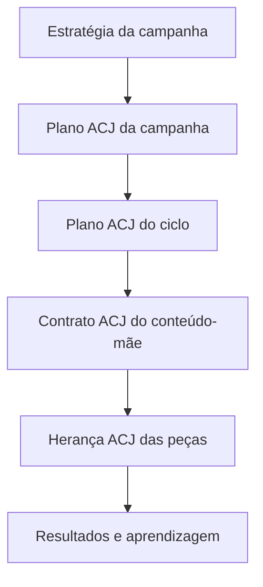

# Template Operacional de Orquestração ACJ

**Contrato entre estratégia, jornada, conteúdo-mãe e peças**

> **Princípio central:** a estratégia define o que a campanha precisa alcançar; a ACJ define que movimentos relacionais precisam ser orquestrados para que a jornada possa acontecer.

# 1 Finalidade

Este documento transforma a governança da ACJ-00 em estruturas operacionais preenchíveis pela Hive. Ele organiza quatro níveis encadeados:

1. Plano ACJ da Campanha;
2. Plano ACJ do Ciclo;
3. Contrato ACJ do Conteúdo-mãe;
4. Herança ACJ das Peças.

O template deve permitir que a Hive:

- traduza necessidades estratégicas em necessidades relacionais;
- proponha um mix ACJ coerente com a fase da campanha;
- recalibre o ciclo sem abandonar a lógica geral;
- atribua uma ACJ primária a cada conteúdo-mãe;
- preserve o movimento nos desdobramentos por canal;
- selecione editorias, pautas, narrativas, M01–M04 e F01–F04 como estruturas subordinadas ao movimento;
- registre desvios, resultados e hipóteses de aprendizagem;
- mantenha rastreabilidade entre plano, execução e Registro Vivo de Aprendizagens ACJ.

# 2 Encadeamento operacional

| Nível | Decisão principal | Horizonte | Fonte canônica |
|---|---|---|---|
| Campanha | Que composição relacional serve à estratégia e à fase? | Campanha inteira e suas fases. | Plano ACJ da Campanha. |
| Ciclo | Que movimentos precisam ganhar prioridade agora? | Período operacional definido. | Plano ACJ do Ciclo. |
| Conteúdo-mãe | Que deslocamento este conteúdo deve produzir? | Uma ideia central channel free. | Contrato ACJ do Conteúdo-mãe. |
| Peça | Como preservar esse movimento neste canal e formato? | Um desdobramento específico. | Herança do conteúdo-mãe com registro de execução. |

# 3 Regras gerais

1. ACJ-00 governa o processo e nunca é atribuída como arquitetura de um conteúdo.
2. ACJ-01 a ACJ-05 não formam um funil obrigatório.
3. Proporções são hipóteses operacionais, não cotas rígidas.
4. O mix ACJ é separado do mix estratégico da campanha.
5. Toda ideia ou conteúdo-mãe possui uma ACJ primária obrigatória.
6. Uma ACJ secundária é opcional e só deve existir quando acrescentar uma função distinta e não concorrente.
7. Mais de duas ACJs em uma mesma ideia exigem divisão do conteúdo ou justificativa excepcional.
8. A ACJ pertence canonicamente ao conteúdo-mãe; peças mantêm apenas herança e snapshot histórico.
9. Templates M01–M04 e estilos F01–F04 não possuem equivalência fixa com nenhuma ACJ.
10. Mudança silenciosa do movimento durante o desdobramento gera nova variante, não simples peça.
11. Resultado comercial não comprova isoladamente que o movimento relacional ocorreu.
12. Aprendizagens ainda não validadas permanecem no Registro Vivo.

# 4 Vocabulário controlado

## 4.1 Arquiteturas selecionáveis

| Código | Nome | Movimento essencial |
|---|---|---|
| ACJ-01 | Reconhecimento | Tornar uma realidade relevante visível e nomeável. |
| ACJ-02 | Identificação | Permitir que a pessoa se localize na realidade apresentada. |
| ACJ-03 | Conexão | Criar segurança, confiança, reciprocidade ou pertencimento. |
| ACJ-04 | Experimentação | Permitir contato vivido com outra possibilidade. |
| ACJ-05 | Aprofundamento | Sustentar integração, complexidade, capacidade e autonomia. |

## 4.2 Estados dos planos e contratos

| Status | Significado |
|---|---|
| draft | Em formulação pela Hive. |
| recommended | Recomendado e pronto para avaliação. |
| approved | Validado por Marcos ou autoridade definida. |
| active | Em execução. |
| recalibration_needed | Evidência ou mudança de contexto exige revisão. |
| completed | Execução encerrada; resultados ainda podem amadurecer. |
| archived | Preservado para histórico. |

## 4.3 Natureza da decisão

| Campo | Valores permitidos |
|---|---|
| `decision_origin` | strategy; acj_00; marcos; execution_feedback; audience_response; journey_result |
| `confidence` | very_low; low; medium; high; very_high |
| `deviation_class` | none; attribution; content; execution; distribution; context |
| `change_class` | no_change; execution_adjustment; architecture_adjustment; new_variant; possible_new_architecture |

# 5 Template A — Plano ACJ da Campanha

## 5.1 Identidade

| Campo técnico | Campo de uso | Obrigatório | Regra |
|---|---|---|---|
| `acj_campaign_plan_id` | ID do Plano ACJ | sim | Único e imutável. |
| `campaign_id` | Campanha vinculada | sim | Deve apontar para uma campanha existente. |
| `version` | Versão do plano | sim | Incrementar após recalibração aprovada. |
| `status` | Status | sim | Usar vocabulário controlado. |
| `created_at` | Data de criação | sim | Data e hora. |
| `created_by` | Responsável | sim | Hive, Marcos ou usuário autorizado. |
| `approved_by` | Aprovador | condicional | Obrigatório para status `approved` ou `active`. |
| `approved_at` | Data da aprovação | condicional | Obrigatório quando houver aprovação. |

## 5.2 Entradas estratégicas

| Campo técnico | Pergunta operacional |
|---|---|
| `campaign_objective` | O que precisa acontecer para o negócio, produto ou presença? |
| `campaign_phase` | Em que fase a campanha se encontra? |
| `strategic_mix` | Qual é a composição estratégica aprovada? |
| `product_or_offer_context` | Existe produto, experiência, evento ou oferta relacionada? |
| `audience_definition` | Para quem a campanha foi desenhada? |
| `audience_state` | Como essa audiência percebe, sente, interpreta ou age hoje? |
| `journey_history` | Que movimentos já foram oferecidos e que respostas produziram? |
| `business_constraints` | Quais são os limites de prazo, orçamento, canal, produção e operação? |
| `identity_constraints` | Que princípios de identidade e linguagem não podem ser violados? |

## 5.3 Diagnóstico relacional

Preencher de forma sintética:

| Campo | Registro |
|---|---|
| Estado atual percebido da audiência |  |
| Estado desejado ao final da campanha |  |
| Necessidades relacionais prioritárias |  |
| Lacunas da jornada |  |
| Movimentos já saturados |  |
| Tensões ou resistências relevantes |  |
| Pontos de entrada possíveis |  |
| Riscos de descontinuidade |  |
| Limites de inferência |  |

## 5.4 Mix-alvo ACJ

| ACJ | Proporção-alvo | Função na campanha | Fase prioritária | Sinal esperado | Risco de excesso |
|---|---:|---|---|---|---|
| ACJ-01 Reconhecimento | 0% |  |  |  |  |
| ACJ-02 Identificação | 0% |  |  |  |  |
| ACJ-03 Conexão | 0% |  |  |  |  |
| ACJ-04 Experimentação | 0% |  |  |  |  |
| ACJ-05 Aprofundamento | 0% |  |  |  |  |
| **Total** | **100%** |  |  |  |  |

As proporções indicam ênfase planejada e devem totalizar 100%. Não determinam uma quantidade fixa de conteúdos quando a campanha ainda não possui volume fechado.

## 5.5 Composição por fase

| Fase | Estado de entrada | Movimento prioritário | ACJ primárias | Pontes previstas | Estado desejado de saída |
|---|---|---|---|---|---|
| 1 |  |  |  |  |  |
| 2 |  |  |  |  |  |
| 3 |  |  |  |  |  |

O número de fases é variável. A fase deve representar uma mudança de necessidade da jornada, não apenas um intervalo de calendário.

## 5.6 Hipóteses de sequência

| ID | Hipótese | Segmento ou condição | Sequência provável | Evidência atual | Confiança | Como observar |
|---|---|---|---|---|---|---|
| SEQ-01 |  |  |  |  |  |  |

Sequências podem incluir retorno, sustentação, reentrada ou repetição. Não pressupõem progressão linear universal.

## 5.7 Sinais e regras de recalibração

| Campo | Registro |
|---|---|
| Sinais da audiência a observar |  |
| Resultados da jornada a observar |  |
| Resultados de negócio pertinentes |  |
| Sinais de lacuna |  |
| Sinais de saturação |  |
| Condições para aumentar uma ACJ |  |
| Condições para reduzir uma ACJ |  |
| Condições para alterar sequência |  |
| Condições que exigem validação de Marcos |  |

## 5.8 Exclusões e limites

Registrar:

- ACJs que não devem ganhar prioridade nesta campanha e por quê;
- movimentos que exigiriam contexto ou facilitação indisponíveis;
- temas, promessas, abordagens ou CTAs incompatíveis com a identidade;
- inferências que os dados atuais ainda não autorizam;
- conflitos conhecidos entre objetivo comercial e necessidade relacional.

## 5.9 Síntese executiva do plano

**A jornada proposta**  

**Por que esta composição serve à estratégia**  

**Principal risco**  

**O que a Hive deve aprender nesta campanha**  

# 6 Template B — Plano ACJ do Ciclo

O ciclo traduz o plano da campanha para o momento atual. Pode afastar-se temporariamente do mix-alvo quando houver lacuna, saturação, resposta inesperada ou necessidade de fase claramente registrada.

## 6.1 Identidade e vínculo

| Campo técnico | Campo de uso | Obrigatório |
|---|---|---|
| `acj_cycle_plan_id` | ID do Plano ACJ do Ciclo | sim |
| `cycle_id` | Ciclo vinculado | sim |
| `acj_campaign_plan_id` | Plano ACJ da Campanha | sim |
| `campaign_plan_version` | Versão herdada | sim |
| `cycle_start` | Início | sim |
| `cycle_end` | Fim | sim |
| `status` | Status | sim |
| `created_at` | Criação | sim |
| `approved_by` | Aprovador | conforme governança |

## 6.2 Leitura do momento

| Campo | Registro |
|---|---|
| Fase atual da campanha |  |
| Estado percebido da audiência |  |
| Conteúdos publicados recentemente |  |
| ACJs realizadas recentemente |  |
| Respostas relevantes |  |
| Lacunas atuais |  |
| Saturações atuais |  |
| Eventos, ofertas ou contextos próximos |  |
| Restrições operacionais do ciclo |  |

## 6.3 Comparação de mixes

| ACJ | Mix-alvo da campanha | Mix realizado acumulado | Mix planejado antes deste ciclo | Mix recomendado para o ciclo | Desvio intencional e justificativa |
|---|---:|---:|---:|---:|---|
| ACJ-01 | 0% | 0% | 0% | 0% |  |
| ACJ-02 | 0% | 0% | 0% | 0% |  |
| ACJ-03 | 0% | 0% | 0% | 0% |  |
| ACJ-04 | 0% | 0% | 0% | 0% |  |
| ACJ-05 | 0% | 0% | 0% | 0% |  |
| **Total** | **100%** | **100%** | **100%** | **100%** |  |

Quando o número de conteúdos for pequeno, mostrar também quantidades absolutas para evitar falsa precisão percentual.

## 6.4 Prioridades do ciclo

| Prioridade | Necessidade relacional | ACJ indicada | Quantidade ou peso | Justificativa | Sinal esperado |
|---|---|---|---:|---|---|
| 1 |  |  |  |  |  |
| 2 |  |  |  |  |  |
| 3 |  |  |  |  |  |

## 6.5 Regras de circulação

| Regra | Definição |
|---|---|
| Ordem recomendada |  |
| Espaçamento entre movimentos |  |
| Conteúdos de sustentação |  |
| Pontes necessárias |  |
| Movimentos que não devem competir |  |
| Reforços condicionais |  |
| Gatilho para recalibração durante o ciclo |  |

## 6.6 Backlog orientado por ACJ

| Ideia ou pauta | Necessidade | ACJ primária | ACJ secundária | Prioridade | Papel na sequência | Status |
|---|---|---|---|---|---|---|
|  |  |  |  |  |  |  |

ACJ não substitui editoria, território, narrativa ou função estratégica. Esses atributos permanecem em seus próprios campos.

## 6.7 Síntese executiva do ciclo

**O que precisa acontecer neste ciclo**  

**Por que o ciclo se aproxima ou se afasta do mix da campanha**  

**O principal sinal que poderá mudar o plano**  

# 7 Template C — Contrato ACJ do Conteúdo-mãe

O contrato ACJ é metadado editorial obrigatório do conteúdo-mãe. Ele deve existir antes da redação final e permanecer channel free.

## 7.1 Identidade e origem

| Campo técnico | Registro |
|---|---|
| `mother_content_id` |  |
| `campaign_id` |  |
| `cycle_id` |  |
| `acj_campaign_plan_id` |  |
| `acj_cycle_plan_id` |  |
| `content_title_working` |  |
| `strategic_function` |  |
| `territory_id` |  |
| `editorial_id` |  |
| `narrative_id` |  |

## 7.2 Atribuição ACJ

| Campo | Registro | Regra |
|---|---|---|
| ACJ primária |  | Obrigatória. |
| ACJ secundária |  | Opcional; máximo de uma. |
| Confiança da atribuição |  | Usar escala controlada. |
| Justificativa |  | Explicar por que a ideia realiza naturalmente a ACJ. |
| Alternativa considerada |  | Registrar quando outra ACJ era plausível. |
| Razão da não escolha |  | Preservar fronteira e aprendizagem. |

## 7.3 Movimento pretendido

| Campo técnico | Pergunta | Registro |
|---|---|---|
| `audience_state_from` | De que estado relacional a pessoa parte? |  |
| `journey_need` | De que movimento ela precisa agora? |  |
| `movement_to` | Que deslocamento o conteúdo pretende favorecer? |  |
| `connection_mechanism` | Por qual mecanismo específico isso deve ocorrer? |  |
| `authorial_gesture` | Que gesto Marcos realiza: nomeia, espelha, acolhe, convida, sustenta ou outro? |  |
| `expected_experience` | O que a pessoa deve poder perceber, sentir, compreender ou experimentar? |  |
| `expected_response` | Que resposta observável seria coerente, sem ser obrigatória? |  |

## 7.4 Realização editorial

| Campo | Registro |
|---|---|
| Tese ou ideia central |  |
| Tensão ou realidade mobilizada |  |
| Caminho narrativo |  |
| Evidência, exemplo ou experiência necessária |  |
| Grau de exposição ou vulnerabilidade |  |
| Convite ou CTA compatível |  |
| Limites e ressalvas |  |
| O que este conteúdo não deve tentar fazer |  |

## 7.5 Compatibilidade de expressão

| Camada | Recomendação | Justificativa | Não confundir com |
|---|---|---|---|
| M01–M04 |  |  | Equivalência automática com ACJ. |
| F01–F04 |  |  | Equivalência automática com ACJ. |
| Formatos possíveis |  |  | Escolha prematura de canal. |
| Recursos visuais |  |  | Estética substituindo o mecanismo. |
| Tom e linguagem |  |  | Simulação verbal do movimento. |

## 7.6 Falhas e sinais

| Campo | Registro |
|---|---|
| Principal modo de falha |  |
| Risco de confusão com outra ACJ |  |
| Risco de excesso ou saturação |  |
| Sinal qualitativo esperado |  |
| Sinal comportamental possível |  |
| Métrica de apoio |  |
| O que não poderá ser concluído pelos resultados |  |

## 7.7 Portão antes da produção

- [ ] A necessidade relacional é real e vinculada ao plano do ciclo.
- [ ] A ideia realiza naturalmente a ACJ primária.
- [ ] O estado de origem e o deslocamento esperado são distintos e compreensíveis.
- [ ] O mecanismo não depende apenas de linguagem declarativa.
- [ ] A ACJ secundária, quando existe, não compete com a primária.
- [ ] O conteúdo não tenta realizar mais de dois movimentos.
- [ ] CTA, exemplo, experiência e expressão visual podem preservar o movimento.
- [ ] Falhas e limites estão registrados.
- [ ] O conteúdo pode ser desdobrado sem depender de um canal específico.

# 8 Template D — Herança ACJ das Peças

Cada peça herda o contrato do conteúdo-mãe. Ela pode adaptar manifestação, ritmo, enquadramento e CTA, mas não redefinir silenciosamente o movimento.

## 8.1 Snapshot de herança

| Campo técnico | Registro |
|---|---|
| `piece_id` |  |
| `mother_content_id` |  |
| `inherited_acj_primary` |  |
| `inherited_acj_secondary` |  |
| `contract_version` |  |
| `channel` |  |
| `format` |  |
| `template_id` |  |
| `photo_style_id` |  |
| `cta_type` |  |
| `scheduled_at` |  |

## 8.2 Adaptação e preservação

| Pergunta | Registro |
|---|---|
| Como o canal manifesta o mecanismo? |  |
| Que elemento do conteúdo-mãe foi priorizado? |  |
| O que foi omitido por limite do formato? |  |
| O CTA preserva o movimento? |  |
| A imagem ou template reforça sem determinar a ACJ? |  |
| Existe desvio de execução? |  |

## 8.3 Classificação do desvio

| Situação | Tratamento |
|---|---|
| Sem desvio | Publicar como peça herdada. |
| Ajuste de manifestação | Registrar adaptação; manter a mesma ACJ. |
| Perda parcial do mecanismo | Revisar antes de publicar ou registrar limitação deliberada. |
| Mudança do movimento primário | Criar nova variante de conteúdo-mãe e novo contrato. |
| Conflito com identidade ou integridade | Interromper e solicitar decisão humana. |

# 9 Resultados vinculados

O resultado precisa manter vínculo com campanha, ciclo, conteúdo-mãe, peça e ACJ atribuída.

| Bloco | Campos mínimos |
|---|---|
| Identidade | `result_id`; campaign_id; cycle_id; mother_content_id; piece_id; published_at. |
| Intenção | acj_primary; acj_secondary; movement_to; expected_response. |
| Exposição | canal; formato; alcance ou audiência exposta; distribuição; investimento; janela. |
| Audiência | sinais qualitativos; linguagem espontânea; interações; comportamentos observáveis. |
| Jornada | progressão; retorno; participação; prática; integração; continuidade. |
| Negócio | conversão ou resultado pertinente, sem atribuição automática à ACJ. |
| Limitações | contexto; comparabilidade; dado ausente; fatores externos. |
| Leitura | observation; confidence; deviation_class; learning_register_id opcional. |

Quando surgir uma observação relevante, a Hive deve abrir ou vincular uma entrada no **Registro Vivo de Aprendizagens ACJ**, seguindo o padrão `ACJL-AAAA-NNN`.

# 10 Regras de recalibração

## 10.1 A Hive pode recalibrar operacionalmente

- prioridade de uma pauta dentro do mix aprovado;
- ordem e espaçamento de conteúdos;
- reforço de uma ACJ diante de lacuna já prevista;
- escolha de manifestação, canal, M01–M04 ou F01–F04;
- ajustes de execução que não alterem mecanismo ou fronteiras;
- recomendação de nova composição para aprovação.

## 10.2 A Hive deve pedir validação humana

- mudança relevante do mix da campanha;
- abandono ou inclusão de fase relacional;
- redefinição do mecanismo de uma ACJ;
- alteração de princípios, condições ou limites;
- formalização de nova variante;
- investigação ou criação de nova arquitetura;
- conflito entre necessidade relacional e identidade estratégica de Marcos.

## 10.3 A Hive deve interromper

- quando os dados forem insuficientes para a decisão solicitada;
- quando estratégia, ideia e necessidade relacional apontarem para direções incompatíveis;
- quando uma experiência exigir facilitação ou segurança indisponíveis;
- quando a recalibração depender de inferência sensível sobre a audiência;
- quando houver risco de manipulação, pressão, exposição ou dependência.

# 11 Portões de qualidade integrados

| Portão | Pergunta | Nível |
|---|---|---|
| G0 Estratégia | A composição ACJ serve ao objetivo e à fase da campanha? | Campanha. |
| G1 Jornada | O movimento responde a uma necessidade relacional real? | Campanha e ciclo. |
| G2 Mix | Proporções, lacunas, saturações e desvios estão justificados? | Campanha e ciclo. |
| G3 Conteúdo | A ideia realiza naturalmente a ACJ atribuída? | Conteúdo-mãe. |
| G4 Mecanismo | O estado de origem, deslocamento e mecanismo estão claros? | Conteúdo-mãe. |
| G5 Herança | As peças preservam o movimento do conteúdo-mãe? | Peça. |
| G6 Expressão | Template, foto, formato e CTA servem ao movimento sem substituí-lo? | Peça. |
| G7 Evidência | A leitura distingue arquitetura, conteúdo, execução, distribuição e contexto? | Resultado. |
| G8 Aprendizagem | Hipótese, confiança e teste são proporcionais à evidência? | Registro Vivo. |
| G9 Governança | A decisão foi tomada no nível de autoridade adequado? | Todos. |

# 12 Saída resumida para a interface

O contrato completo pode operar internamente. A interface deve mostrar apenas o necessário para cada decisão.

| Tela ou momento | Exibição essencial |
|---|---|
| Estratégia definida | “Esta campanha também possui uma arquitetura relacional, recalibrada conforme a jornada.” |
| Plano ou backlog | Mix ACJ, fase atual, lacunas e prioridades. |
| Pauta recomendada | ACJ primária, movimento desejado e papel na sequência. |
| Validação do conteúdo | Estado de origem, deslocamento, mecanismo e principal risco. |
| Produção visual | ACJ como contexto semântico para M01–M04 e F01–F04. |
| Agenda | Ordem, espaçamento, equilíbrio e reforços. |
| Resultados | Sinal esperado, observado, limitações e possível aprendizagem. |

Marcos não precisa preencher todos os campos operacionais. A Hive deve apresentar sínteses, recomendações e conflitos que realmente exigem julgamento humano.

# 13 Exemplo de saída executiva da Hive

O formato abaixo é estrutural e não representa uma campanha real.

**Leitura do momento**  
[Síntese do estado percebido da audiência e da fase.]

**Movimento prioritário**  
[ACJ recomendada e deslocamento esperado.]

**Composição do ciclo**  
[Mix recomendado com principal diferença em relação ao plano da campanha.]

**Por que agora**  
[Lacuna, saturação, sequência ou contexto que justifica a decisão.]

**Risco principal**  
[Falha provável ou conflito que merece atenção.]

**O que precisa da decisão de Marcos**  
[Somente a decisão não automatizável.]

# 14 Histórico e versionamento

| Versão | Data | Mudança | Evidência | Aprovação |
|---|---|---|---|---|
| 0.1 | 2026-09-29 | Primeira formulação dos contratos operacionais de campanha, ciclo, conteúdo-mãe e peça. | ACJ-00, Integração ACJ e Registro Vivo. | pendente |

# 15 Portões de qualidade deste documento

| Portão | Status | Evidência ou pendência |
|---|---|---|
| Q0 Encadeamento | atendido | Campanha, ciclo, conteúdo-mãe e peça possuem contratos vinculados. |
| Q1 Separação | atendido | Mix estratégico e mix ACJ permanecem independentes e relacionados. |
| Q2 Atribuição | atendido | ACJ primária obrigatória e secundária opcional foram definidas. |
| Q3 Herança | atendido | Conteúdo-mãe é canônico e peças mantêm snapshot sem competir com a fonte. |
| Q4 Expressão | atendido | M01–M04 e F01–F04 recebem ACJ como contexto sem equivalência fixa. |
| Q5 Resultado | atendido | Sinais de audiência, jornada, negócio e limitações permanecem distintos. |
| Q6 Aprendizagem | atendido | Ligação com Registro Vivo e classes de desvio foi preservada. |
| Q7 Governança | atendido | Autonomia, validação e interrupção foram explicitadas. |
| Q8 Validação humana | pendente | Estrutura exige validação de Marcos e compatibilização técnica com Raul. |

# 16 Decisões propostas para validação

1. A operação ACJ será composta por quatro objetos vinculados: plano da campanha, plano do ciclo, contrato do conteúdo-mãe e herança da peça.
2. O Plano ACJ da Campanha convive com o mix estratégico sem substituí-lo.
3. O ciclo pode afastar-se temporariamente do mix-alvo quando a justificativa e o sinal esperado estiverem registrados.
4. Toda ideia ou conteúdo-mãe possui uma ACJ primária; uma secundária é opcional e limitada a uma.
5. O conteúdo-mãe é a fonte canônica da ACJ e permanece channel free.
6. Mudança do movimento em uma adaptação cria nova variante, não simples peça.
7. M01–M04 e F01–F04 recebem a ACJ como contexto semântico, sem mapeamento fixo.
8. A interface apresenta sínteses e decisões; os campos completos operam como contrato interno da Hive.
9. Resultados comerciais e métricas de canal não comprovam isoladamente a realização de uma ACJ.
10. Observações relevantes são vinculadas ao Registro Vivo antes de qualquer consolidação estrutural.
